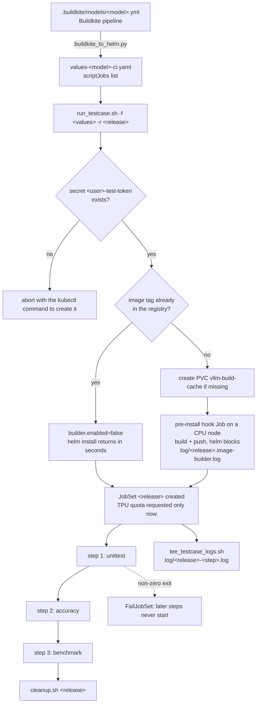

# Run vLLM TPU CI Testcases on GKE

This Helm chart executes the very same commands the Buildkite model pipeline runs —
`unittest`, `accuracy`, `benchmark` — one after another, on real TPU hardware, against an
image built from the commits *you* choose.

It exists so you can find out whether CI will pass **before** you open a PR, using GKE
`tpu7x` capacity instead of waiting for a Buildkite TPU agent.

```bash
# The whole flow, once the prerequisites below are in place:
python3 bin/buildkite_to_helm.py -b ../../models/meta-llama_Llama-3_1-8B-Instruct.yml
bin/run_testcase.sh -f values-meta-llama_Llama-3_1-8B-Instruct-ci.yaml -r my-run
bin/tee_testcase_logs.sh -c all my-run
bin/cleanup.sh my-run
```

> 📖 **Cluster reference**: everything here runs on the shared GKE TPU v7x cluster
> (`bodaborg-tpu7x-nap` in project `cloud-tpu-shared-capacity`, region `us-central1`), as
> documented in the
> [TPU v7x Shared Cluster User Guide](https://docs.google.com/document/d/1qgrT8aW0MlPCcCqtQNlr7HqOn3wpv9BaFGFr0H7ynbU/).

---

## Table of Contents

- [Why this exists](#why-this-exists)
- [How a run works](#how-a-run-works)
  - [What a release creates in the cluster](#what-a-release-creates-in-the-cluster)
  - [Directory layout](#directory-layout)
- [Prerequisites](#prerequisites)
- [Step 1 — Generate a values file from the Buildkite pipeline](#step-1--generate-a-values-file-from-the-buildkite-pipeline)
- [Step 2 — Deploy with `run_testcase.sh`](#step-2--deploy-with-run_testcasesh)
- [Step 3 — Follow the run](#step-3--follow-the-run)
- [Step 4 — Read the result](#step-4--read-the-result)
- [Step 5 — Tear down](#step-5--tear-down)
- [Configuration reference](#configuration-reference)
  - [`scriptJobs`](#scriptjobs)
  - [Storage modes & caching](#storage-modes--caching)
  - [Values files](#values-files)
- [Recipes](#recipes)
- [Troubleshooting](#troubleshooting)
- [Tooling reference](#tooling-reference)
  - [Buildkite pipeline converter (`buildkite_to_helm.py`)](#buildkite-pipeline-converter-buildkite_to_helmpy)
  - [Testcase log streamer (`bin/tee_testcase_logs.sh`)](#testcase-log-streamer-bintee_testcase_logssh)
  - [Cluster capacity & admission diagnostics (`bin/cluster_status.sh`)](#cluster-capacity--admission-diagnostics-bincluster_statussh)
  - [Teardown (`bin/cleanup.sh`)](#teardown-bincleanupsh)
- [Image builder (CPU-only pre-install hook)](#image-builder-cpu-only-pre-install-hook)

---

## Why this exists

| Situation | What this chart gives you |
| :--- | :--- |
| You changed `tpu-inference` (or want to pin a specific vLLM commit) and want to know whether CI will pass **before** opening a PR | Builds an image from your exact commits and runs the real pipeline steps against it |
| Buildkite has no free TPU agents, or the queue is too long | Runs the same steps on the GKE `tpu7x` pool using Kueue quota, independent of Buildkite capacity |

> [!IMPORTANT]
> A step runs with `parallelism: 1, completions: 1`, i.e. **one Pod**. There is no Ray
> bootstrap, so use single-host topologies (`2x2x1` on `tpu7x` = 4 chips). A multi-VM
> topology would schedule one Pod against a slice it cannot fill.

---

## How a run works



The image build is deliberately **outside** the JobSet: it runs as a CPU-only Helm
`pre-install` hook so that no TPU capacity is held (and no TPU node failure can kill the run)
while building. See [Image builder](#image-builder-cpu-only-pre-install-hook).

### What a release creates in the cluster

```text
Helm release  dennis-e2e
├── Job     dennis-e2e-image-builder             (pre-install hook, CPU node; skipped on a registry hit)
└── JobSet  dennis-e2e
    ├── replicatedJob unittest  → Job dennis-e2e-unittest-0  → 1 Pod
    │     └── container     test-runner          (the TPU workload; + gke-gcsfuse-sidecar with gcs storage)
    ├── replicatedJob accuracy  → Job dennis-e2e-accuracy-0  → 1 Pod
    └── replicatedJob benchmark → Job dennis-e2e-benchmark-0 → 1 Pod
```

Steps start in declaration order and the first failure aborts the rest
(`startupPolicy: InOrder` + `failurePolicy: FailJobSet`).

### Directory layout

```text
.buildkite/gke/helm/                                  # chart root; run every command from here
├── Chart.yaml                                        # Chart metadata
├── values.yaml                                       # Base defaults; every key below is documented inline
├── values-transfer-template.yaml                     # Base template inherited by bin/buildkite_to_helm.py
├── values-meta-llama_Llama-3_1-8B-Instruct-ci.yaml   # Example converter output: 3 CI steps on tpu7x
├── bin/
│   ├── buildkite_to_helm.py                          # Buildkite pipeline → Helm values converter
│   ├── run_testcase.sh                               # Deployment runner (registry check, build, helm install)
│   ├── tee_testcase_logs.sh                          # Per-step / per-container log streamer; its exit code is the result
│   ├── cluster_status.sh                             # Cluster capacity, Kueue quota, pre-flight admission check
│   └── cleanup.sh                                    # helm uninstall + kubectl sweep
├── extras/
│   └── build-cache-pvc.yaml                          # Shared Docker build cache claim (created by run_testcase.sh, not by Helm)
├── templates/
│   ├── _helpers.tpl                                  # Topology maths, image reference, storage volumes, builder script
│   ├── image-builder-job.yaml                        # CPU-only pre-install hook that builds & pushes the image
│   └── jobset.yaml                                   # One replicatedJob per scriptJobs entry
└── log/                                              # Streamed logs land here (git-ignored)
```

Every script resolves the chart root from its own location, so they also work when
invoked by absolute path from anywhere.

---

## Prerequisites

### 1. Tools, authentication and cluster credentials

You need `gcloud` (latest), `gke-gcloud-auth-plugin`, `kubectl` v1.26+, `helm` v3.10+, and
`jq` + `bc` (the diagnostic scripts use them for JSON parsing and math).

```bash
# One-off installation (Debian/Ubuntu/gLinux)
gcloud components install kubectl gke-gcloud-auth-plugin
curl https://raw.githubusercontent.com/helm/helm/main/scripts/get-helm-3 | bash
sudo apt-get update && sudo apt-get install -y jq bc

# Authenticate: user credentials, then ADC (used by GCS clients), then the project
gcloud auth login
gcloud auth application-default login
gcloud config set project cloud-tpu-shared-capacity

# Point kubectl and helm at the TPU cluster, and confirm it answers
gcloud container clusters get-credentials bodaborg-tpu7x-nap \
  --region us-central1 --project cloud-tpu-shared-capacity
kubectl get nodes -l cloud.google.com/gke-tpu-accelerator=tpu7x
```

### 2. Hugging Face token secret — the name comes from your username

`run_testcase.sh` always passes `--set hfTokenSecret.name=<user>-test-token`, so whatever the
values file says is overridden. The script aborts early if the secret or its key is missing:

```bash
kubectl create secret generic "$(whoami | tr -dc 'a-z0-9')-test-token" \
  --from-literal=token='<your-hugging-face-token>' \
  --dry-run=client -o yaml | kubectl apply -f -
```

The **key** (`token` by default) is still read from the values file's `hfTokenSecret.key`.

### 3. Service account and registry access

Set `.Values.serviceAccount` to a Kubernetes service account in your namespace — the default
in `values.yaml` is somebody else's and will not work for you.

When `builder.enabled: true`, that KSA also needs registry **write** access. The build pod
authenticates through Workload Identity, i.e. as the KSA, *not* as the node. The KSA needs an
`iam.gke.io/gcp-service-account` annotation mapping to a GSA with read and write access to
`image.registry`. A wrong mapping fails fast with a `denied:` message instead of building for
half an hour first.

### 4. Kueue queue and capacity

Both the hook Job and the JobSet are submitted to the LocalQueue in `builder.queueName`
(default `default`). If the queue does not exist, workloads stay `Suspended` forever.

```bash
# Cluster capacity dashboard, reservation headroom, queue status:
bin/cluster_status.sh

# Will this values file be admitted right now?
bin/cluster_status.sh -c values-meta-llama_Llama-3_1-8B-Instruct-ci.yaml -q default
```

---

## Step 1 — Generate a values file from the Buildkite pipeline

[`buildkite_to_helm.py`](./bin/buildkite_to_helm.py) reads a Buildkite model pipeline and keeps only
the steps that actually run in a container (`.buildkite/scripts/run_in_docker.sh`), dropping
bookkeeping steps such as `record_step_result.sh`.

```bash
python3 bin/buildkite_to_helm.py \
  -b ../../models/meta-llama_Llama-3_1-8B-Instruct.yml \
  -o values-meta-llama_Llama-3_1-8B-Instruct-ci.yaml
```

Input — one Buildkite step:

```yaml
- label: "${TPU_VERSION:-tpu6e} Accuracy for meta-llama/Llama-3.1-8B-Instruct"
  key: "${TPU_VERSION:-tpu6e}_meta-llama_Llama-3_1-8B-Instruct_Accuracy"
  agents:
    queue: "${TPU_QUEUE_SINGLE:-tpu_v6e_queue}"
  env:
    TEST_MODEL: meta-llama/Llama-3.1-8B-Instruct
    TENSOR_PARALLEL_SIZE: "${TENSOR_PARALLEL_SIZE_SINGLE:-1}"
    MINIMUM_ACCURACY_THRESHOLD: 0.75
  commands:
    - |
      .buildkite/scripts/run_in_docker.sh bash /workspace/tpu_inference/tests/e2e/benchmarking/test_accuracy.sh
```

Output — one `scriptJobs` entry:

```yaml
- name: accuracy                                  # from the text after the last '_' in `key`, lowercased
  command: bash /workspace/tpu_inference/tests/e2e/benchmarking/test_accuracy.sh   # run_in_docker.sh stripped
  workingDir: /workspace/vllm
  backoffLimit: 0
  env:                                            # ${VAR:-default} expansions resolved
    TEST_MODEL: meta-llama/Llama-3.1-8B-Instruct
    TENSOR_PARALLEL_SIZE: '2'                     # --tensor-parallel-size 2 overrides the default
    MINIMUM_ACCURACY_THRESHOLD: '0.75'
```

Everything that is not step-specific — `image.registry`, `image.tpuInferenceCommit`,
`image.vllmCommit`, `builder`, `storage`, `hfTokenSecret` — is inherited from
[`values-transfer-template.yaml`](./values-transfer-template.yaml) (override with
`--base-values`). Full flag list:
[Buildkite pipeline converter](#buildkite-pipeline-converter-buildkite_to_helmpy).

> [!TIP]
> Point `image.tpuInferenceCommit` / `image.vllmCommit` at the commits you want to validate.
> The image tag is `<tpuInferenceCommit>-<vllmCommit>-<accelerator>`, so a new commit
> automatically means a new tag, a registry miss, and a fresh build.

---

## Step 2 — Deploy with `run_testcase.sh`

```bash
bin/run_testcase.sh -f values-meta-llama_Llama-3_1-8B-Instruct-ci.yaml -r dennis-e2e
```

| Option | Meaning |
| :--- | :--- |
| `-f <file>` | **Required.** `values.yaml` or `values-*.yaml` living next to the script (no paths) |
| `-r <name>` | Release **and** JobSet name. Default `<user>-test-<random>`; 1–53 chars, `[a-z0-9-]` |
| `-h` | Help |
| `BUILD_TIMEOUT=3h` | Env var; overrides `builder.timeout` (`helm install --timeout`) |

What it does, in order: verify the HF secret → resolve the target image tag by rendering the
hook manifest → ask Artifact Registry whether that tag exists → on a hit disable the build hook
entirely, on a miss create the build cache PVC if needed and block on the build → `helm install`
→ print the monitoring commands.

Registry hit (the common case, a few seconds):

```text
✅ Kubernetes secret 'dennisyeh-test-token' (key: 'token') verified successfully.
🔍 Checking whether us-central1-docker.pkg.dev/.../vllm-tpu:0b8c1f7a...-51da0ca6...-tpu7x already exists in the registry...
✅ Image already published; skipping the build hook entirely.
🚀 Deploying Helm release 'dennis-e2e' ...
```

Registry miss (blocks until the build finishes; ~5 min with a warm cache, ~40 min cold):

```text
🏗️  Image not found. It will be built by the pre-install hook on a CPU node.
✅ Build cache 'vllm-build-cache' already exists (300Gi, left untouched).
   (helm will block until the image build finishes; timeout 90m)
📜 Streaming build log to .../log/dennis-e2e.image-builder.log
⏳ Waiting for the image-builder pod (Kueue admission)...
```

Either way it finishes by printing a numbered list of monitoring commands for this release
(JobSet status, pod watch, the `tee_testcase_logs.sh` invocation, and — when a build ran — where
its log went).

---

## Step 3 — Follow the run

`helm install` returns as soon as the JobSet is created, so open a second terminal:

```bash
# every step, every container the Pod has, colour-tagged
bin/tee_testcase_logs.sh -c all -j dennis-e2e
```

Produces one file per step and container, never overwriting an existing file:

```text
log/dennis-e2e.image-builder.log        # only when a build actually ran
log/dennis-e2e-unittest.log             # test-runner (main container)
log/dennis-e2e-accuracy.log
log/dennis-e2e-benchmark.log
log/dennis-e2e-benchmark.gke-gcsfuse-sidecar.log   # only with gcs storage
```

The streamer survives Kueue preemption and TPU node failures: it waits for the replacement Pod,
re-attaches and marks the switch in the log. Details and all flags:
[Testcase log streamer](#testcase-log-streamer-bintee_testcase_logssh).

---

## Step 4 — Read the result

The streamer's exit code *is* the testcase result, so CI can branch on it directly:

| Exit code | Meaning | What to do |
| :--- | :--- | :--- |
| `0` | Every step's `test-runner` exited 0 | Done |
| non-zero | The first failing step's exit code; later steps were never started | Read `log/<release>-<step>.log` |
| `130` | The JobSet disappeared mid-run (`helm uninstall`, `cleanup.sh`, `kubectl delete`) | Deliberate cancellation — **not** a red test |

`run_testcase.sh` itself exits non-zero only for deployment problems (missing secret, bad
values file, failed build hook, `helm install` timeout); it does not wait for the tests.

---

## Step 5 — Tear down

```bash
bin/cleanup.sh dennis-e2e
```

This is `helm uninstall` **plus** a `kubectl` sweep of a leftover JobSet and
`<release>-scripts` ConfigMap, and it does not fail when the release is already gone — the
usual way runs get stranded is a half-finished uninstall.

> [!WARNING]
> Neither `cleanup.sh` nor `helm uninstall` removes the build hook Job
> (`<release>-image-builder`): it is kept on purpose so a failed build stays inspectable.
> Delete it manually with `kubectl delete job <release>-image-builder`.
> `cleanup.sh --all` only matches the `<user>-test-` prefix and never calls Helm, so a custom
> `-r` name still needs an explicit `helm uninstall`.

---

## Configuration reference

Every key in [`values.yaml`](./values.yaml) is documented inline; this section covers the two
parts you actually edit per run.

### `scriptJobs`

```yaml
scriptJobs:
- name: unittest            # required; RFC 1123 label, becomes the replicatedJob and log file name
  command: bash -c '...'    # required; executed with `exec` inside the test-runner container
  workingDir: /workspace/vllm   # optional; falls back to /workspace if missing
  backoffLimit: 0           # optional; retries for THIS step (default 1 when the key is absent)
  env:                      # optional; injected as container env vars
    TEST_MODEL: meta-llama/Llama-3.1-8B-Instruct
  tpu:                      # optional per-step hardware override
    topology: 2x2x1
    accelerator: tpu7x
  resources:                # optional per-step resource override
    tpu: 4
    cpu: '32'
    memory: 100Gi
```

Resolution order for hardware settings is **step → global → built-in default**:

| Setting | Step-level key | Global fallback | Built-in default |
| :--- | :--- | :--- | :--- |
| Topology | `scriptJobs[].tpu.topology` | `tpu.topology` | `1x2x1` |
| Accelerator | `scriptJobs[].tpu.accelerator` | `tpu.accelerator` | `tpu7x` |
| TPU chips | `scriptJobs[].resources.tpu` | `resources.tpu` | chips implied by the topology (capped at 4/VM) |
| CPU | `scriptJobs[].resources.cpu` | `resources.cpu` | `32` |
| Memory | `scriptJobs[].resources.memory` | `resources.memory` | `100Gi` |
| Retries | `scriptJobs[].backoffLimit` | — | `1` |

Every step also gets `HF_TOKEN` / `HUGGING_FACE_HUB_TOKEN` from the secret, plus
`VLLM_TARGET_DEVICE=tpu`, `PJRT_DEVICE=TPU`, `TPU_VERSION`, `HF_HUB_DISABLE_DISK_LOCK=1`,
a memory-backed `/dev/shm`, and whatever [Storage modes & caching](#storage-modes--caching)
mounts for `storage.type`.

> [!NOTE]
> All steps of a JobSet are admitted by Kueue as **one** Workload, so the quota the run needs
> is the *sum* over `scriptJobs`, requested at once — three steps at 4 chips each need 12 chips
> free, not 4. `cluster_status.sh -c <values file>` does this sum for you.

### Storage modes & caching

Configured via `storage.type`:

| Mode | Volume type | Best used when | Configuration |
| :--- | :--- | :--- | :--- |
| **`ramdisk`** | In-memory `emptyDir` (`medium: Memory`) | Ephemeral testing directly from Hugging Face Hub | `storage.type: "ramdisk"`<br>`storage.ramCacheLimit: "80Gi"` |
| **`gcs-cache`** | GCS FUSE CSI mount | Warm boots across runs by caching Hugging Face downloads to GCS | `storage.type: "gcs-cache"`<br>`storage.bucketName: "<bucket>"` |
| **`gcs-direct`** | Direct GCS mount | Weights already stored in GCS | `storage.type: "gcs-direct"`<br>`storage.cacheSubpath: "<path>"` |

### Values files

| File | Purpose |
| :--- | :--- |
| [`values.yaml`](./values.yaml) | Chart defaults. Every key is commented; a single `benchmark` step is defined as an example |
| [`values-transfer-template.yaml`](./values-transfer-template.yaml) | Base template auto-detected by `buildkite_to_helm.py`; image registry, commits, builder, storage and secrets are inherited from here |
| [`values-meta-llama_Llama-3_1-8B-Instruct-ci.yaml`](./values-meta-llama_Llama-3_1-8B-Instruct-ci.yaml) | Example converter output: the three CI steps (`unittest`, `accuracy`, `benchmark`) run sequentially on `2x2x1` `tpu7x` |

---

## Recipes

```bash
# Validate the rendered JobSet without touching the cluster
helm template test . -f values-meta-llama_Llama-3_1-8B-Instruct-ci.yaml | less

# Run only one step: delete the other entries from scriptJobs, or stream just one step
bin/tee_testcase_logs.sh -r benchmark -j dennis-e2e

# Test another commit: edit image.tpuInferenceCommit (the tag changes => a build is triggered)
sed -i 's/^  tpuInferenceCommit:.*/  tpuInferenceCommit: <new-sha>/' values-...-ci.yaml

# Force a rebuild of an existing tag: delete it from the registry first
gcloud artifacts docker images delete <registry>:<tpuCommit>-<vllmCommit>-tpu7x --delete-tags

# Skip the builder entirely and use an image somebody else already pushed
#   set builder.enabled: false and image.registry/commits to the published tag

# Give one heavy step more room without changing the others
#   scriptJobs[].resources.memory: 200Gi

# Longer build budget (cold cache, slow network)
BUILD_TIMEOUT=3h bin/run_testcase.sh -f values-...-ci.yaml -r dennis-e2e
```

---

## Troubleshooting

| Symptom | Cause | Fix |
| :--- | :--- | :--- |
| `❌ Error: Kubernetes secret '<user>-test-token' does not exist` | The secret name comes from your OS username, not the values file | Create it with the command the script prints |
| `Error: cannot re-use a name that is still in use` | A previous release with that name still exists (possibly with no JobSet left) | `helm uninstall <release>` or `bin/cleanup.sh <release>` |
| `helm install` hangs at `⏳ Waiting for the image-builder pod` | Kueue has not admitted the build Job (missing LocalQueue, or no CPU quota) | `kubectl get workload`; check `builder.queueName` exists |
| Build fails with `denied: Permission ... artifactregistry` | The pod's KSA is not mapped to a GSA with write access to the registry | Fix `.Values.serviceAccount` / its `iam.gke.io/gcp-service-account` annotation |
| Build pod stays `Pending` with an unbound volume | The `ReadWriteOncePod` cache PVC is still mounted by another build | Wait, or `kubectl get pods -l app.kubernetes.io/component=image-builder` |
| Step Pod stays `Pending` / JobSet `SUSPENDED: true` | Waiting for TPU capacity in Kueue | `bin/cluster_status.sh`; consider fewer steps or a smaller topology |
| Test steps never start, `helm install` timed out | Helm does **not** stop the hook Job on timeout; the build is still running | `kubectl get job <release>-image-builder`, then retry with a bigger `BUILD_TIMEOUT` |
| Streamer exits `130` unexpectedly | Someone deleted the JobSet (`helm uninstall` / `cleanup.sh`) | Not a test failure; re-deploy |
| Second step never ran | `failurePolicy: FailJobSet` — the previous step failed | Read that step's log |

---

## Tooling reference

### Buildkite pipeline converter (`buildkite_to_helm.py`)

Converts any Buildkite model pipeline YAML (from `.buildkite/models/*.yml`) into a Helm values
file. It keeps only the steps that invoke `.buildkite/scripts/run_in_docker.sh` (skipping
bookkeeping steps such as `record_step_result.sh`), resolves `${VAR:-default}` Bash expansions,
and derives an RFC 1123 job name from the substring after the last `_` of the step key. See
[Step 1](#step-1--generate-a-values-file-from-the-buildkite-pipeline) for a worked example.

| Flag | Meaning |
| :--- | :--- |
| `-b, --buildkite-yml <file>` | **Required.** The Buildkite model pipeline to convert |
| `-o, --output <file>` | Output path. Defaults to `values-<pipeline basename>-ci.yaml` |
| `-v, --values-only` | Print to stdout instead of writing a file |
| `--step <step_key>` | Convert only this step. Matches step keys, sanitised names or stages, and lists what is available if nothing matches |
| `--base-values <file>` | Inherit non-step settings from here instead of auto-detecting `values-transfer-template.yaml` → `values.yaml` |
| `--accelerator {tpu7x,tpu6e}` | Override the accelerator resolved from `${TPU_VERSION:-...}` (default `tpu7x`) |
| `--topology <t>` / `--tpu-limit <n>` | Override the per-step hardware (default: from the base values, or `2x2x1`) |
| `--tensor-parallel-size <n>` | Override `TENSOR_PARALLEL_SIZE` in the generated steps |
| `--registry <ref>` | Override `image.registry` |
| `--hf-secret-name` / `--hf-secret-key` | Override `hfTokenSecret` (`run_testcase.sh` overrides the name again at deploy time) |

```bash
# Convert every qualifying step into a multi-step values file:
python3 bin/buildkite_to_helm.py \
  -b ../../models/meta-llama_Llama-3_1-8B-Instruct.yml \
  -o values-meta-llama_Llama-3_1-8B-Instruct-ci.yaml

# Extract one step only, with a TP override:
python3 bin/buildkite_to_helm.py \
  -b ../../models/meta-llama_Llama-3_1-8B-Instruct.yml \
  --step tpu7x_meta-llama_Llama-3_1-8B-Instruct_Benchmark \
  --tensor-parallel-size 2 \
  -o values-llama8b-bench.yaml
```

### Testcase log streamer (`bin/tee_testcase_logs.sh`)

Follows a release along **both** of its dimensions: every step (`scriptJobs` → replicatedJob)
in the order the JobSet runs them, and every container inside each step's Pod — see
[What a release creates in the cluster](#what-a-release-creates-in-the-cluster) for that shape.

> [!NOTE]
> The on-demand image build is **not** part of the JobSet. It runs beforehand as a CPU-only
> Helm pre-install hook Job, so this streamer never sees it — see
> [Image builder](#image-builder-cpu-only-pre-install-hook) for where that log goes.

| Option | Meaning |
| :--- | :--- |
| `-j, --job <name>` | JobSet name. Also accepted positionally; omitted means auto-detect the newest `<user>-test-*` |
| `-r, --replicated-job <name>` | Follow only this step (e.g. `benchmark`); default is every step |
| `-c, --container <c>` | Container to read (default `test-runner`). `all` streams every container concurrently |
| `-a, --all` | Shorthand for `-c all` |
| `-l, --list` | List the containers of each step's Pod and exit |
| `-s, --dump` | Snapshot current logs without following |
| `-o, --dir <dir>` | Output directory (default `<chart>/log`) |
| `-n, --number <n>` | Numeric suffix for the log files |
| `-t, --timeout <sec>` | Seconds to wait for each step's Pod; time spent `Suspended` in the queue does not count |

Behaviour worth knowing:

- **Sequential steps**: waits for each step's Pod (the timeout is counted only once the step is
  reached), streams it, then moves on. The first step whose main container exits non-zero
  aborts the run and its exit code is propagated, matching the chart's
  `startupPolicyOrder: InOrder` + `FailJobSet` policy.
- **Container discovery**: the container list comes from the live Pod spec, so optional
  containers (the gcsfuse sidecar) appear automatically.
- **Per-container termination tracking**: streaming of a container stops when *that* container
  terminates, not when the whole Pod does, so one long-lived sidecar cannot hold the run open.
- **Survives eviction / requeue**: a Pod can be destroyed mid-run by Kueue (preemption, TAS node
  failures) or by a Job backoff restart. A missing Pod is *not* treated as the end of the run —
  only the step's Job condition (`Complete`/`Failed`) is. The streamer waits for the replacement
  Pod, re-attaches, and appends a `===== [tee] ... pod <name> disappeared ... =====` marker.
- **Transient API errors are not deletion**: only an explicit `NotFound` from the API server
  counts as "the JobSet is gone". A throttled or timed-out `kubectl` is retried, so a slow
  cluster cannot be mistaken for a teardown.
- **Result resolution**: the exit code comes from the container's `terminated.exitCode`, falling
  back to the Job condition when the Pod has already been garbage-collected.
- **Cancellation vs failure**: if the JobSet disappears mid-run the streamer reports
  `🛑 JobSet '<name>' was deleted (helm uninstall?) - run cancelled` and exits **130**, so a
  deliberate teardown is never mistaken for a red test result.
- **Log files**: `log/<JOBSET>-<step>.log[N]` for the main container and
  `log/<JOBSET>-<step>.<container>.log[N]` for the others. Existing files are never
  overwritten; the whole run shares one numeric suffix.

```bash
bin/tee_testcase_logs.sh                                   # newest run, test-runner of every step
bin/tee_testcase_logs.sh -c all dennis-test-a1b2c          # every container, colour-tagged
bin/tee_testcase_logs.sh -r benchmark dennis-test-a1b2c    # one step only
bin/tee_testcase_logs.sh --dump -c all dennis-test-a1b2c   # snapshot a finished run
bin/tee_testcase_logs.sh --list                            # which containers does each step have?
```

### Cluster capacity & admission diagnostics (`bin/cluster_status.sh`)

A seven-section dashboard: physical TPU hardware by topology (allocated vs free), GCE
reservation headroom, Kueue quota per flavor (nominal / used / borrowed / remaining), a
traffic-light admission guide (🟢 instant, 🟡 scale-up, 🔴 queued), queued workloads with their
blocking reason, admitted workloads with their runtimes, and cluster anomalies (DiskPressure
nodes, `ExitCode 137` / `CrashLoopBackOff` pods, broken multi-host slices).

| Option | Meaning |
| :--- | :--- |
| `-c, --check <TOPO\|CHIPS\|values file>` | Pre-flight check: can this workload start now? |
| `-q, --queue <name>` | Target queue (default `default`) |
| `-w, --watch` | Live refresh |
| `-i, --interval <n>` | Refresh interval in seconds (default 10) |
| `-a, --anomalies-only` | Only anomalies, failures and warnings |

```bash
# Full dashboard:
bin/cluster_status.sh

# Single topology, or a raw chip count:
bin/cluster_status.sh -c 2x2x1 -q default
bin/cluster_status.sh -c 64    -q default

# A whole testcase values file — sums every scriptJobs step:
bin/cluster_status.sh -c values-meta-llama_Llama-3_1-8B-Instruct-ci.yaml -q default
```

Sample output for a three-step testcase:

```text
🔍 PRE-FLIGHT ADMISSION CHECK for 'values-meta-llama_Llama-3_1-8B-Instruct-ci.yaml' in queue 'default':
 Component       Topology     Count    Chips/Slice    Total Chips    Idle Slices in GKE   Action Required
 -------------   ----------   ------   ------------   ------------   ------------------   ----------------------------
 unittest        2x2x1        1        4              4              2 slice(s) free      🟢 Instant Start (Use idle slice)
 accuracy        2x2x1        1        4              4              2 slice(s) free      🟢 Instant Start (Use idle slice)
 benchmark       2x2x1        1        4              4              1 slice(s) free      🟡 needs NAP scale-up
 -------------   ----------   ------   ------------   ------------   ------------------   ----------------------------
 Total Workload  -            3        -              12             -                    (Scale-up needed: 4 chips)
```

> [!IMPORTANT]
> The **Total Workload** row is the number that matters. A JobSet is one Kueue Workload, so
> every step's podSet is assigned a flavor at admission time even though `InOrder` runs them
> one at a time. If the total does not fit, the whole run queues — a three-step testcase on a
> cluster with 4 free chips waits, even though each individual step would fit.

### Teardown (`bin/cleanup.sh`)

```bash
# Clean up one release (helm uninstall + JobSet + ConfigMap sweep):
bin/cleanup.sh dennis-e2e

# Every JobSet/ConfigMap matching the '<user>-test-' prefix (does NOT call helm):
bin/cleanup.sh --all

# Only orphaned '<user>-test-*-scripts' ConfigMaps:
bin/cleanup.sh --configmaps
```

---

## Image builder (CPU-only pre-install hook)

When `builder.enabled: true`, the chart builds
`<registry>:<tpuInferenceCommit>-<vllmCommit>-<tpuVersion>` on demand and pushes it to Artifact
Registry before anything else is deployed.

### Why it is not an initContainer

A JobSet is admitted by Kueue as a **single Workload**: every `replicatedJob`'s podSet receives
a ResourceFlavor and TAS node assignment at admission time, even though
`startupPolicyOrder: InOrder` runs only one step at a time. A build living inside the JobSet
therefore:

- held the TPU quota of *every* step for the full duration of the build, and
- was evicted whenever any of those pre-assigned TPU nodes went unhealthy, which threw away the
  entire build and started over.

Running the build as a Helm `pre-install` hook
([`templates/image-builder-job.yaml`](./templates/image-builder-job.yaml)) means the JobSet does
not exist yet while building, so **no TPU capacity is reserved at all**.

### How it runs

| Aspect | Detail |
| --- | --- |
| Where | `cpu-np` node pool. The Job requests no `google.com/tpu`, so Kueue assigns the `cpu-user` flavor, which already carries the required nodeSelector and toleration |
| Auth | GCE metadata server token → `docker login -u oauth2accesstoken`. Every node pool runs with `GKE_METADATA`, so the token belongs to the pod's **Kubernetes service account** (`.Values.serviceAccount`, via its `iam.gke.io/gcp-service-account` annotation), not to the node. A builder running as `default` gets a 403 |
| Cache | PVC `vllm-build-cache` (300Gi) mounted at `/var/lib/docker`, shared by all releases, so image layers **and** the BuildKit pip cache survive between runs |
| Cache GC | Checked once per build, immediately before `docker build`: above `builder.cache.highWatermarkPercent` it prunes images/containers, then the BuildKit cache down to `lowWatermarkPercent` |
| Retries | `backoffLimit: 2`, `activeDeadlineSeconds: 4800` (Kueue queueing time does not count) |
| Lifetime | `hook-delete-policy: before-hook-creation` — a failed Job is kept for inspection and replaced on the next install. `helm uninstall` does **not** remove it |

### Consequences for `run_testcase.sh`

- It checks Artifact Registry first. If the tag already exists the hook is disabled via
  `--set builder.enabled=false` and `helm install` returns immediately.
- Otherwise it creates the cache PVC if missing, then **blocks** until the build finishes,
  streaming the build to `log/<release>.image-builder.log`.
- On failure it reports the log path and reminds you to `helm uninstall <release>` before
  retrying (a failed release keeps the name reserved).
- `BUILD_TIMEOUT=3h bin/run_testcase.sh ...` overrides `builder.timeout`.

### Managing the shared cache

The claim is declared in [`extras/build-cache-pvc.yaml`](./extras/build-cache-pvc.yaml) and
deliberately lives outside the chart: a Helm hook resource would be deleted and recreated on
every install (wiping the cache), and a normal template would be applied *after* the hook runs.
`run_testcase.sh` only creates it when absent and never modifies an existing one — if the live
claim is smaller than the manifest asks for it prints the `kubectl patch` command and leaves the
decision to you.

Space is reclaimed automatically, but only when a build is actually going to run (a registry
fast-path hit prunes nothing) and only in the order that costs least:

| Usage of `/var/lib/docker` | Action |
| --- | --- |
| `< highWatermarkPercent` (70%) | nothing |
| `≥ 70%` | `docker container prune` + `docker image prune -a` — free, because those images are already in the registry and layer reuse comes from the BuildKit cache |
| still `≥ 70%` | `docker buildx prune --min-free-space` down to `lowWatermarkPercent` (50%) — this does cost build time later |
| still `≥ 70%` afterwards | warning only; the build proceeds and the claim probably needs to grow |

The metric is `df /var/lib/docker`, not `docker system df`: only the former counts the
overlay2/containerd leftovers that actually fill the volume.

```bash
# Current usage is printed by the builder itself (df before the build,
# `docker system df` at start and end).
kubectl get pvc vllm-build-cache

# Grow it (standard-rwo has allowVolumeExpansion: true; this cannot be undone).
# The PV is resized immediately; the filesystem grows when the next builder pod
# mounts it, so `.status.capacity` lags behind until then.
kubectl patch pvc vllm-build-cache -p '{"spec":{"resources":{"requests":{"storage":"600Gi"}}}}'

# Wipe it; the next build starts cold:
kubectl delete pvc vllm-build-cache
```

> [!WARNING]
> The claim is `ReadWriteOncePod`, so only one build can run at a time. A second concurrent
> build stays `Pending` until the first finishes, rather than starting a second `dockerd` on the
> same data root. Because tags are content-addressed, the second build then usually hits the
> registry fast-path and exits immediately.
