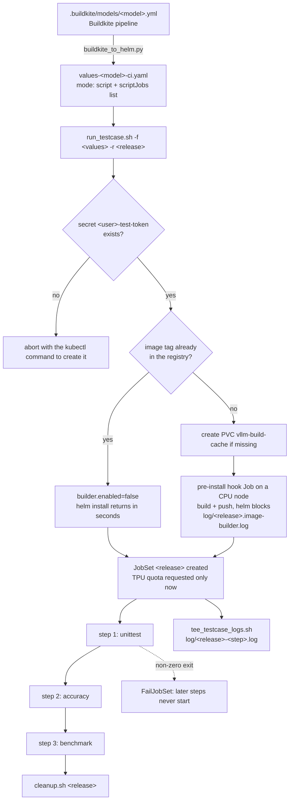

# TPU vLLM Benchmark Helm Chart

A unified, production-grade Helm chart for deploying, orchestrating, and benchmarking large language models (LLMs) with **vLLM** on **Google Cloud TPUs (v7x)** via Kubernetes **JobSets** and **Kueue**.

Supports both **Monolithic (Aggregated)** and **Disaggregated (Prefill/Decode P/D)** inference architectures from a single, templated chart.

> For direct **Kubernetes JobSet template execution** (`kubectl apply`), see [../kubectl/README.md](../kubectl/README.md).
> For cluster diagnostic tools ([`bin/cluster_status.sh`](../bin/cluster_status.sh)), live workload monitoring ([`bin/job_status.sh`](../bin/job_status.sh)), log streaming ([`bin/tee_logs.sh`](../bin/tee_logs.sh)), and cleanup automation, see the parent [GKE Operations Guide](../README.md).

---

## Table of Contents

The chart drives two different workflows. Sections are grouped accordingly.

**Chart reference** — shared by every mode

- [Chart Structure](#chart-structure)
- [Architecture & Template Implementation](#architecture--template-implementation)
  - [1. Monolithic Mode (`mode: "aggregated"`)](#1-monolithic-mode-mode-aggregated)
  - [2. Disaggregated Mode (`mode: "disaggregated"`)](#2-disaggregated-mode-mode-disaggregated)
  - [3. Exclusive Topology Affinity & Slice Colocation](#3-exclusive-topology-affinity--slice-colocation)
  - [4. Helper Templates (`_helpers.tpl`)](#4-helper-templates-_helperstpl)
- [Storage Modes & Caching](#storage-modes--caching)
- [Values Files Catalog](#values-files-catalog)
- [Values Schema Reference](#values-schema-reference)

**Track A — Serving benchmarks** (`mode: "aggregated"` / `"disaggregated"`)

- [Helm Automation Runner (`run_benchmark.sh`)](#helm-automation-runner-run_benchmarksh)
  - [Prerequisites & Environment Setup](#prerequisites--environment-setup)
  - [Usage & Options](#usage--options)
  - [Container Image Quick Switches](#container-image-quick-switches)
  - [Example Commands](#example-commands)
- [Helm CLI Workflow](#helm-cli-workflow)
  - [Install / Deploy](#install--deploy)
  - [Render / Dry-Run (`helm template`)](#render--dry-run-helm-template)
  - [Uninstall / Teardown](#uninstall--teardown)

**Track B — CI testcases on TPU** (`mode: "script"`)

- [Script Mode: Run CI Testcases on GKE](#script-mode-run-ci-testcases-on-gke)
  - [Why this exists](#why-this-exists)
  - [How it differs from the serving modes](#how-it-differs-from-the-serving-modes)
  - [End-to-end workflow](#end-to-end-workflow)
  - [What a release creates in the cluster](#what-a-release-creates-in-the-cluster)
  - [Prerequisites specific to script mode](#prerequisites-specific-to-script-mode)
  - [Step 1 — Generate a values file from the Buildkite pipeline](#step-1--generate-a-values-file-from-the-buildkite-pipeline)
  - [Step 2 — Deploy with `run_testcase.sh`](#step-2--deploy-with-run_testcasesh)
  - [Step 3 — Follow the run](#step-3--follow-the-run)
  - [Step 4 — Read the result](#step-4--read-the-result)
  - [Step 5 — Tear down](#step-5--tear-down)
  - [`scriptJobs` reference](#scriptjobs-reference)
  - [Recipes](#recipes)
  - [Troubleshooting](#troubleshooting)
- [Buildkite CI Pipeline Converter (`buildkite_to_helm.py`)](#buildkite-ci-pipeline-converter-buildkite_to_helmpy)
- [Testcase Log Streamer (`../bin/tee_testcase_logs.sh`)](#testcase-log-streamer-bintee_testcase_logssh)
- [Image Builder (CPU-only pre-install hook)](#image-builder-cpu-only-pre-install-hook)

---

## Chart Structure

```text
gke/helm/
├── Chart.yaml                          # Helm chart metadata (v0.1.0)
├── values.yaml                         # Base default configuration
├── buildkite_to_helm.py                # Buildkite CI pipeline to Helm values converter (script mode)
├── run_benchmark.sh                    # Automated Helm benchmark deployment script (serving modes)
├── run_testcase.sh                     # Automated Helm testcase deployment script (script mode)
├── values-llama8b.yaml                 # Monolithic Llama-3.1-8B (2x2x1, 1 VM)
├── values-transfer-template.yaml       # Base template inherited by buildkite_to_helm.py (script mode)
├── values-meta-llama_Llama-3_1-8B-Instruct-ci.yaml  # Example converter output: 3 CI steps on tpu7x
├── values-llama70b.yaml                # Monolithic Llama-3.1-70B (2x2x4, 4 VMs via Ray)
├── values-qwen4b.yaml                  # Monolithic Qwen3.5-4B (2x2x1, 1 VM)
├── values-disagg-llama8b.yaml          # Disaggregated 8B (Prefill 2x2x1, Decode 2x2x2)
├── values-disagg-llama70b.yaml         # Disaggregated 70B (Prefill 2x2x4, 2x Decode 2x2x4 = 12 VMs, 96 TPUs)
├── values-disagg-symmetric.yaml        # Disaggregated 8B (Prefill 2x2x1, Decode 2x2x1)
├── values-disagg-2decode.yaml          # Disaggregated 8B (Prefill 2x2x1, 2x Decode 2x2x1)
├── extras/
│   └── build-cache-pvc.yaml            # Shared Docker build cache claim (created by run_testcase.sh, not by Helm)
└── templates/
    ├── _helpers.tpl                    # Hardware sizing macros, TP math & placement calculations
    ├── configmap.yaml                  # Embedded startup scripts, health probes & benchmark runner
    ├── image-builder-job.yaml          # CPU-only pre-install hook that builds & pushes the image
    └── jobset.yaml                     # Unified JobSet manifest (aggregated, disaggregated & script)

```

---

## Architecture & Template Implementation

> [!NOTE]
> This section covers the two **serving** modes. The chart has a third mode,
> `mode: "script"`, which runs CI testcases instead of serving a model — see
> [Script Mode](#script-mode-run-ci-testcases-on-gke).

### 1. Monolithic Mode (`mode: "aggregated"`)

In monolithic mode, `templates/jobset.yaml` renders two `replicatedJobs`:

```
                   +-------------------------------------------------------------+
                   |                     Kubernetes JobSet                       |
                   |                                                             |
                   |   +-----------------------------------------------------+   |
                   |   |               ReplicatedJob: server                 |   |
                   |   |  (Single-host: 1 VM | Multi-host: N VMs via Ray)    |   |
                   |   |  - Step 0: Pre-cache weights (GCS / HF / RAM)       |   |
                   |   |  - Step 1: TPU XLA compilation & graph warmup       |   |
                   |   |  - Step 2: vLLM OpenAI-compatible API Server (:8000)|   |
                   |   +--------------------------^--------------------------+   |
                   |                              | (Health polling & HTTP)      |
                   |   +--------------------------v--------------------------+   |
                   |   |               ReplicatedJob: client                 |   |
                   |   |          (Runs on dedicated CPU nodes)              |   |
                   |   |  - Progressive 5-stage benchmark suite (128-3072 tok)|  |
                   |   |  - All stages finished -> Exit 0 -> Teardown JobSet |   |
                   |   +-----------------------------------------------------+   |
                   +-------------------------------------------------------------+
```

- **Server Job (`replicatedJob: server`)**: Runs on TPU nodes (`cloud.google.com/gke-tpu-accelerator: tpu7x`). For multi-host topologies (e.g. `2x2x4`), Worker 0 acts as the Ray Head, and Workers 1..N join as Ray Workers.
- **Client Job (`replicatedJob: client`)**: Runs on CPU nodes (`cloud.google.com/gke-nodepool: cpu-np`), polls server readiness, runs the 5-stage progressive benchmark, and terminates the JobSet upon completion.

---

### 2. Disaggregated Mode (`mode: "disaggregated"`)

Separates prefill computation and decode token generation across independent TPU slices linked via high-speed P2P KV connectors (`TPUConnector` or `TPURaidenConnector`). `templates/jobset.yaml` renders four `replicatedJobs`:

```
       +-----------------------------------------------------------------------------------------+
       |                                   Kubernetes JobSet                                     |
       |                                                                                         |
       |  +--------------------------------+             +------------------------------------+  |
       |  |     ReplicatedJob 1: p         |             |        ReplicatedJob 2: d          |  |
       |  |  Prefill Slice (KV Producer)   |             |   Decode Slice (KV Consumer)       |  |
       |  |  TPU v7 (e.g. 2x2x1 / TP=4)    |             |   TPU v7 (e.g. 2x2x2 / TP=8)       |  |
       |  |  Serves on Port 8400           |             |   Serves on Port 9400              |  |
       |  +---------------^----------------+             +-----------------^------------------+  |
       |                  |                                                |                     |
       |                  |        High-Speed P2P KV Transfer (:9100)      |                     |
       |                  +================================================+                     |
       |                                                                                         |
       |                                          ^                                              |
       |                                          |                                              |
       |                       +------------------v-------------------+                          |
       |                       |        ReplicatedJob 3: x            |                          |
       |                       |      Disaggregated Proxy Router      |                          |
       |                       |    (CPU Pod - Port 8000 via HTTP)    |                          |
       |                       +------------------^-------------------+                          |
       |                                          |                                              |
       |                       +------------------v-------------------+                          |
       |                       |       ReplicatedJob 4: client        |                          |
       |                       |       Progressive Benchmark Suite    |                          |
       |                       +--------------------------------------+                          |
       +-----------------------------------------------------------------------------------------+
```

- **Prefill Job (`replicatedJob: p`)**: Handles prompt processing and KV cache generation, serving internal requests on port 8400.
- **Decode Job (`replicatedJob: d`)**: Handles autoregressive token generation on port 9400. Configurable with multiple replicas (`decode.replicas: 2`).
- **Proxy Router (`replicatedJob: x`)**: Lightweight CPU pod running `toy_proxy_server.py` on port 8000. It dynamically inspects request lengths and routes them to prefill and decode instances.
- **Benchmark Client (`replicatedJob: client`)**: Sends traffic to proxy port 8000.

---

### 3. Exclusive Topology Affinity & Slice Colocation

Multi-host TPU pods must be scheduled on the same physical TPU slice. If pods from a single multi-host slice are scheduled across different physical node pools, the Inter-Chip Interconnect (ICI) initialization fails with `SLICE_FAILURE_CHIP_DRIVER_ERROR`.

In `templates/jobset.yaml`, exclusive topology is conditionally applied:

```yaml
{{- if or (gt (include "tpu.numVMs" .Values.tpu.topology | int) 1) (and (eq .Values.mode "disaggregated") (or (gt (include "tpu.numVMs" .Values.prefill.tpu.topology | int) 1) (gt (include "tpu.numVMs" .Values.decode.tpu.topology | int) 1))) }}
alpha.jobset.sigs.k8s.io/exclusive-topology: cloud.google.com/gke-nodepool
{{- end }}
```

- **TPU Jobs (`server`, `p`, `d`)**: Scheduled with 1:1 mapping to dedicated TPU node pools created by GKE Node Auto-Provisioning (NAP).
- **CPU Jobs (`x`, `client`)**: Explicitly override node affinity via `cloud.google.com/gke-nodepool: cpu-np`, allowing them to run in the shared CPU pool without blocking or triggering new TPU node pool allocations.

---

### 4. Helper Templates (`_helpers.tpl`)

The template library calculates all hardware and distributed parameters automatically:

| Helper Function | Purpose | Example |
| :--- | :--- | :--- |
| `tpu.numVMs` | Computes VM count from topology string: $(X \times Y \times Z) / 4$ | `2x2x4` &rarr; `4` VMs |
| `tpu.tpSize` | Computes Tensor Parallel size: $X \times Y \times Z$ | `2x2x4` &rarr; `16` TP |
| `tpu.processBounds` | Calculates JAX multi-host process bounds | `2x2x4` &rarr; `1,1,4` |
| `tpu.chipsPerProcessBounds` | Calculates chips-per-process bounds | Standard v7x &rarr; `2,2,1` |
| `tpu.placementPolicy` | Queries/formats GCE Compact Placement Policy for multi-host VMs | e.g. `tpu7x-2x2x4-compact` |

---

## Storage Modes & Caching

Configured via `storage.type` in values:

| Mode | Volume Type | Best Used When | Configuration |
| :--- | :--- | :--- | :--- |
| **`ramdisk`** | In-Memory `emptyDir` (`medium: Memory`) | Ephemeral testing directly from Hugging Face Hub. | `storage.type: "ramdisk"`<br>`storage.ramCacheLimit: "80Gi"` |
| **`gcs-cache`** | GCS FUSE CSI Mount | Warm boots across runs by caching Hugging Face downloads to GCS. | `storage.type: "gcs-cache"`<br>`storage.bucketName: "<bucket>"` |
| **`gcs-direct`** | Direct GCS Mount | Serving pre-downloaded weights already stored in GCS. | `storage.type: "gcs-direct"`<br>`model.name: "gs://<bucket>/<path>"` |

> **Cache Verification Speedup**: In `gcs-cache` mode, `templates/configmap.yaml` downloads weights using `ignore_patterns=['original/*']`. This ignores redundant 140 GB PyTorch `.pth` un-sharded checkpoints, cutting GCS cache verification from **2+ hours down to ~45 seconds**.

---

## Values Files Catalog

| Preset File | Architecture | Model | TPU Slices & Hardware | Notes |
| :--- | :--- | :--- | :--- | :--- |
| [`values.yaml`](./values.yaml) | Monolithic | Llama-3.1-8B | `2x2x1` (1 VM, 4 chips) | Base default values |
| [`values-llama8b.yaml`](./values-llama8b.yaml) | Monolithic | Llama-3.1-8B | `2x2x1` (1 VM, 4 chips) | Monolithic baseline |
| [`values-transfer-template.yaml`](./values-transfer-template.yaml) | Script Runner (`mode: "script"`) | Llama-3.1-8B | `2x2x1` (1 VM, 4 chips, `tpu7x`) | Base template auto-detected by `buildkite_to_helm.py` (image registry, commits, builder, storage, secrets are inherited from here). Also deployable as-is: runs `benchmark.sh`, sonnet dataset, TP=2, threshold >= 10.77 req/s |
| [`values-meta-llama_Llama-3_1-8B-Instruct-ci.yaml`](./values-meta-llama_Llama-3_1-8B-Instruct-ci.yaml) | Script Runner (`mode: "script"`) | Llama-3.1-8B | `2x2x1` (1 VM, 4 chips, `tpu7x`) | Example `buildkite_to_helm.py` output: the three CI steps (`unittest`, `accuracy`, `benchmark`) run sequentially. See [Script Mode](#script-mode-run-ci-testcases-on-gke) |
| [`values-llama70b.yaml`](./values-llama70b.yaml) | Monolithic | Llama-3.1-70B | `2x2x4` (4 VMs, 16 chips via Ray) | Multi-host monolithic benchmark |
| [`values-qwen4b.yaml`](./values-qwen4b.yaml) | Monolithic | Qwen3.5-4B | `2x2x1` (1 VM, 4 chips) | Lightweight 4B test |
| [`values-disagg-symmetric.yaml`](./values-disagg-symmetric.yaml) | Disaggregated | Llama-3.1-8B | Prefill `2x2x1`, Decode `2x2x1` | 1:1 symmetric serving (10 RPS) |
| [`values-disagg-llama8b.yaml`](./values-disagg-llama8b.yaml) | Disaggregated | Llama-3.1-8B | Prefill `2x2x1`, Decode `2x2x2` | 1:2 asymmetric serving (35 RPS) |
| [`values-disagg-llama70b.yaml`](./values-disagg-llama70b.yaml) | Disaggregated | Llama-3.1-70B | Prefill `2x2x4`, 2x Decode `2x2x4` | 12 VMs, 96 TPU v7x chips with topology colocation |
| [`values-disagg-2decode.yaml`](./values-disagg-2decode.yaml) | Disaggregated | Llama-3.1-8B | Prefill `2x2x1`, 2x Decode `2x2x1` | 1 Prefill + 2 Decode replicas |

---

## Values Schema Reference

Key parameters in `values.yaml`:

```yaml
mode: "aggregated"                    # "aggregated" (monolithic) | "disaggregated" | "script" (CI testcases)

model:
  name: "meta-llama/Llama-3.1-8B-Instruct"  # HuggingFace ID or gs:// URI
  servedName: ""                      # Override tokenizer/model name

image:
  repository: "docker.io/vllm/vllm-tpu"
  tag: "v0.27.0"

# Monolithic settings:
tpu:
  topology: "2x2x1"                   # TPU topology shape
  placementPolicy: ""                 # Compact placement policy (required if VMs > 1)
  resources:
    cpu: "32"
    memory: "64Gi"
    tpu: 4

# Disaggregated settings (used when mode: "disaggregated"):
prefill:
  replicas: 1
  tpu:
    topology: "2x2x1"
    placementPolicy: ""
  port: 8400

decode:
  replicas: 1                         # Number of decode slice replicas
  tpu:
    topology: "2x2x2"
    placementPolicy: ""
  port: 9400
  connector: "TPUConnector"           # "TPUConnector" or "TPURaidenConnector"

proxy:
  port: 8000
  resources:
    cpu: "8"
    memory: "16Gi"

storage:
  type: "gcs-cache"                   # "ramdisk", "gcs-cache", or "gcs-direct"
  bucketName: "my-gcs-bucket"
  cacheSubpath: "hf-cache"
  ramCacheLimit: "80Gi"

job:
  declaredDurationMinutes: 90         # Max Kueue reservation duration
  backoffLimit: 2                     # Retry tolerance for transient network reconnects
  priorityClass: "medium"

benchmark:
  requestRate: 35.0                   # Benchmark request rate in req/s
  stages:                             # Progressive prompt/output evaluation stages
    - inputLen: 128
      outputLen: 128
      numPrompts: 100
    - inputLen: 512
      outputLen: 256
      numPrompts: 100
    - inputLen: 1024
      outputLen: 512
      numPrompts: 100
    - inputLen: 2048
      outputLen: 512
      numPrompts: 100
    - inputLen: 3072
      outputLen: 512
      numPrompts: 100
```

---

## Helm Automation Runner (`run_benchmark.sh`)

[`run_benchmark.sh`](./run_benchmark.sh) is a Helm-powered automation runner that dynamically calculates TPU hardware sizing (VMs, Tensor Parallel size, chip/process bounds, placement policies), formats a custom `values.yaml`, and automatically deploys the chart via `helm install` or renders manifests via `helm template`.

### Prerequisites & Environment Setup

Before running benchmarks with `run_benchmark.sh`, ensure your local workstation or Cloud Shell environment has the necessary tools, Google Cloud authentication, cluster access, and Hugging Face credentials configured.

#### 1. Install Required Tools

Ensure the following command-line tools are installed on your system:

| Tool | Minimum Version | Description & Verification |
| :--- | :--- | :--- |
| **`gcloud`** | Latest | Google Cloud SDK (`gcloud version`) |
| **`gke-gcloud-auth-plugin`** | Latest | Required GKE authentication plugin for `kubectl` |
| **`kubectl`** | v1.26+ | Kubernetes CLI (`kubectl version --client`) |
| **`helm`** | v3.10+ | Helm package manager (`helm version`) |
| **`jq` & `bc`** | Any | Required by diagnostic and runner scripts for JSON parsing and math |

**Quick Installation (Debian/Ubuntu/gLinux):**

```bash
# Install gke-gcloud-auth-plugin and kubectl via gcloud
gcloud components install kubectl gke-gcloud-auth-plugin

# Install Helm
curl https://raw.githubusercontent.com/helm/helm/main/scripts/get-helm-3 | bash

# Install jq and bc utilities
sudo apt-get update && sudo apt-get install -y jq bc
```

#### 2. Authenticate with Google Cloud

Authenticate both your user credentials and Application Default Credentials (ADC) used by Google Cloud SDKs and GCS storage clients:

```bash
# 1. Log in to your Google Cloud user account
gcloud auth login

# 2. Generate Application Default Credentials (ADC) for GCS bucket storage & APIs
gcloud auth application-default login

# 3. Set your target GCP project
gcloud config set project cloud-tpu-shared-capacity
```

#### 3. Connect to the GKE TPU Cluster

Obtain cluster credentials to point `kubectl` and `helm` to the target GKE cluster:

```bash
# Fetch credentials for the TPU cluster (example: bodaborg-tpu7x-nap in us-central1)
gcloud container clusters get-credentials bodaborg-tpu7x-nap \
  --region us-central1 \
  --project cloud-tpu-shared-capacity

# Verify cluster connection and TPU node availability
kubectl get nodes -l cloud.google.com/gke-tpu-accelerator=tpu7x
```

#### 4. Configure Hugging Face Secret

For gated or access-controlled models (e.g. `meta-llama/Llama-3.1-8B-Instruct`, `meta-llama/Llama-3.1-70B-Instruct`), the runner automatically mounts a Kubernetes Secret named `${CLEAN_USER}-test-token` (where `${CLEAN_USER}` is your lowercase alphanumeric username):

```bash
# Determine your clean username prefix (e.g. 'johndoe' -> 'johndoe-test-token')
CLEAN_USER=$(echo "${USER}" | tr '[:upper:]' '[:lower:]' | tr -dc 'a-z0-9')

# Create or update the secret in your Kubernetes namespace
kubectl create secret generic "${CLEAN_USER}-test-token" \
  --from-literal=HF_TOKEN="hf_your_actual_token_here" \
  --dry-run=client -o yaml | kubectl apply -f -
```

> [!TIP]
> Verify your secret exists with:
>
> ```bash
> kubectl get secret "${CLEAN_USER}-test-token"
> ```

#### 5. Verify Cluster Headroom & TPU Quota

Before submitting a benchmark job, check physical TPU slice availability and Kueue queue quotas:

```bash
# View cluster capacity dashboard, reservation headroom, and queue status:
./gke/bin/cluster_status.sh

# Or test instant admission for your target topology (e.g. 2x2x1):
./gke/bin/cluster_status.sh -c 2x2x1 -q default
```

### Usage & Options

```bash
./gke/helm/run_benchmark.sh [OPTIONS]
```

| Flag | Category | Description | Default |
| :--- | :--- | :--- | :--- |
| `-m, --model <model>` | Common | Model name, HF repo ID, or `gs://` URI | `meta-llama/Llama-3.1-8B-Instruct` |
| `-i, --image <image>` | Common | Docker container image or alias (`torchtpu`, `tpu-inference`) | `docker.io/vllm/vllm-tpu:v0.27.0` |
| `--torchtpu` | Common | Quick switch to Google TorchTPU production image (`torchtpu-vllm-prod:latest`) | `false` |
| `--tpu-inference` | Common | Quick switch to upstream `tpu-inference` image (`vllm-tpu:v0.27.0`) | `true` (default) |
| `-b, --bucket <bucket>` | Common | GCS bucket path for caching (e.g. `gs://<bucket>/hf-cache`) | `""` (RAM-Disk mode) |
| `-r, --release <name>` | Common | Custom Helm release name | Auto-generated (`${USER}-test-<rand>`) |
| `-s, --sa <sa>` | Common | Kubernetes ServiceAccount | `vllm-sa` |
| `-R, --rate <rps>` | Common | Benchmark request rate in req/s | `10.0` |
| `-L, --prefix-len <N>` | Common / APC | Fixed shared prompt prefix length across requests (enables APC test) | `0` (pure random) |
| `-D, --duration <mins>` | Common | Maximum Kueue reservation duration in minutes | `90` |
| `-o, --output <file>` | Common | Save dynamically generated `values.yaml` to file (skips deployment) | `""` |
| `-v, --values-only` | Common | Print generated `values.yaml` to stdout without deploying | `false` |
| `-g, --dry-run` | Common | Render full Kubernetes JobSet manifest (`helm template`) to stdout | `false` |
| `-t, --topology <topo>` | Monolithic | TPU v7 topology shape (`2x2x1`, `2x2x4`, etc.) | `2x2x1` |
| `-P, --policy <name>` | Monolithic | GCE Compact Placement Policy name (auto-queried on multi-host) | `""` |
| `--async-scheduling` / `--no-async-scheduling` | Features | Enable/disable async CPU/TPU scheduling | `true` (enabled) |
| `--prefix-caching` / `--no-prefix-caching` | Features | Enable/disable Automatic Prefix Caching (APC) | `true` (enabled) |
| `--chunked-prefill` / `--no-chunked-prefill` | Features | Enable/disable chunked prefill | `true` (enabled) |
| `--max-batched-tokens <N>` | Features | Max tokens per chunked prefill iteration | `2048` |
| `--wide-ep, --ep` | Features | Enable Wide Expert Parallelism for MoE models | `false` |
| `--spec-decode, --draft-model <repo>` | Features | Enable Speculative Decoding (Eagle3) with draft model | `false` |
| `--spec-tokens <N>` | Features | Number of candidate tokens proposed per step | `3` |
| `--kv-offload, --no-kv-offload` | Features | Enable Host DRAM KV Cache Offloading | `false` |
| `--offload-connector <name>` | Features | KV Cache Offload connector (`RaidenOffloadConnector` / `TPUOffloadConnector`) | `RaidenOffloadConnector` |
| `--structured-output` | Features | Enable grammar-guided structured decoding (JSON schema) | `false` |
| `--disagg` | Disaggregated | Enable Disaggregated Prefill/Decode architecture | `false` |
| `-p, --prefill <topo>` | Disaggregated | Prefill TPU v7 topology | `2x2x1` |
| `-d, --decode <topo>` | Disaggregated | Decode TPU v7 topology | `2x2x2` |
| `-N, --decode-replicas <N>` | Disaggregated | Number of Decode slices to scale horizontally | `1` |
| `-c, --connector <name>` | Disaggregated | KV Connector: `TPUConnector` or `TPURaidenConnector` | Auto-detected |

### Container Image Quick Switches

The chart defaults to the official upstream `tpu-inference` image, but allows instant toggling between both TPU container environments:

```bash
# 1. Default: Upstream tpu-inference image (docker.io/vllm/vllm-tpu:v0.27.0)
./gke/helm/run_benchmark.sh -t 2x2x1 -m meta-llama/Llama-3.1-8B-Instruct

# 2. Quick switch to Google TorchTPU image (torchtpu-vllm-prod:latest)
./gke/helm/run_benchmark.sh -t 2x2x1 -m meta-llama/Llama-3.1-8B-Instruct --torchtpu
# Or using the -i alias:
./gke/helm/run_benchmark.sh -t 2x2x1 -m meta-llama/Llama-3.1-8B-Instruct -i torchtpu

# 3. Explicitly re-select tpu-inference
./gke/helm/run_benchmark.sh -t 2x2x1 -m meta-llama/Llama-3.1-8B-Instruct --tpu-inference
# Or:
./gke/helm/run_benchmark.sh -t 2x2x1 -m meta-llama/Llama-3.1-8B-Instruct -i tpu-inference
```

### Example Commands

```bash
# A/B Prefix Caching Benchmark:
# 1. Baseline (Prefix Caching disabled, full 1024 cold prefill every time):
./gke/helm/run_benchmark.sh -t 2x2x1 -m meta-llama/Llama-3.1-8B-Instruct --no-prefix-caching -L 1024

# 2. Optimized (Prefix Caching enabled, reuses 1024 prefix tokens across all requests):
./gke/helm/run_benchmark.sh -t 2x2x1 -m meta-llama/Llama-3.1-8B-Instruct --prefix-caching -L 1024

# 3. Run APC benchmark on Google's TorchTPU image:
./gke/helm/run_benchmark.sh -t 2x2x1 -m meta-llama/Llama-3.1-8B-Instruct --torchtpu --prefix-caching -L 1024

# Monolithic serving with Speculative Decoding (Eagle3):
./gke/helm/run_benchmark.sh -t 2x2x1 -m meta-llama/Llama-3.1-8B-Instruct --spec-decode --draft-model yuhuili/EAGLE-LLaMA3-Instruct-8B -b gs://my-bucket/hf-cache

# Disable prefix caching & chunked prefill for baseline comparison:
./gke/helm/run_benchmark.sh -t 2x2x1 -m meta-llama/Llama-3.1-8B-Instruct --no-prefix-caching --no-chunked-prefill

# MoE model with Wide Expert Parallelism:
./gke/helm/run_benchmark.sh -t 2x2x4 -m Qwen/Qwen3.5-35B-A3B-FP8 --wide-ep

# Disaggregated serving with Async Scheduling & Chunked Prefill:
./gke/helm/run_benchmark.sh --disagg -p 2x2x1 -d 2x2x2 -m meta-llama/Llama-3.1-8B-Instruct --async-scheduling --chunked-prefill --max-batched-tokens 1024

# 1. Monolithic Single-host (TPU 2x2x1, 1 VM):
./gke/helm/run_benchmark.sh -t 2x2x1 -m meta-llama/Llama-3.1-8B-Instruct -b gs://my-bucket/hf-cache

# 2. Monolithic Multi-host (TPU 2x2x4, 4 VMs via Ray):
./gke/helm/run_benchmark.sh -t 2x2x4 -m meta-llama/Llama-3.1-70B-Instruct -b gs://my-bucket/hf-cache

# 3. Disaggregated Asymmetric Serving (Prefill 2x2x1, Decode 2x2x2 @ 35 RPS):
./gke/helm/run_benchmark.sh --disagg -p 2x2x1 -d 2x2x2 -m meta-llama/Llama-3.1-8B-Instruct -R 35.0 -b gs://my-bucket/hf-cache

# 4. Disaggregated Horizontal Decode Scaling (1x Prefill 2x2x1, 2x Decode 2x2x1 @ 35 RPS):
./gke/helm/run_benchmark.sh --disagg -p 2x2x1 -d 2x2x1 -N 2 -m meta-llama/Llama-3.1-8B-Instruct -R 35.0 -b gs://my-bucket/hf-cache

# 5. Generate and inspect values.yaml without deploying:
./gke/helm/run_benchmark.sh --disagg -p 2x2x4 -d 2x2x4 -N 2 -m meta-llama/Llama-3.1-70B-Instruct -v

# 6. Dry-run render full Kubernetes manifest (helm template):
./gke/helm/run_benchmark.sh --disagg -p 2x2x1 -d 2x2x2 -m meta-llama/Llama-3.1-8B-Instruct -g
```

---

## Helm CLI Workflow

### Install / Deploy

```bash
# 1. Deploy Asymmetric Disaggregated 8B Benchmark:
helm install my-disagg-run ./gke/helm -f ./gke/helm/values-disagg-llama8b.yaml

# 2. Deploy Multi-Host 70B Disaggregated Benchmark (96 chips):
helm install my-70b-disagg ./gke/helm -f ./gke/helm/values-disagg-llama70b.yaml

# 3. Deploy Monolithic 70B Multi-Host Benchmark:
helm install my-70b-mono ./gke/helm -f ./gke/helm/values-llama70b.yaml

# 4. Deploy with inline value overrides:
helm install my-run ./gke/helm \
  -f ./gke/helm/values-llama8b.yaml \
  --set benchmark.requestRate=50.0 \
  --set storage.type=ramdisk
```

### Render / Dry-Run (`helm template`)

To inspect the generated Kubernetes JobSet YAML without deploying:

```bash
# Render full manifest:
helm template my-test ./gke/helm -f ./gke/helm/values-disagg-llama70b.yaml

# Verify only JobSet resource:
helm template my-test ./gke/helm -f ./gke/helm/values-disagg-llama70b.yaml -s templates/jobset.yaml
```

### Uninstall / Teardown

```bash
# Uninstall release via Helm:
helm uninstall my-70b-disagg

# Or use the comprehensive cleanup script:
./gke/bin/cleanup.sh my-70b-disagg
```

---

## Script Mode: Run CI Testcases on GKE

`mode: "script"` turns this chart into a **CI testcase runner**. Instead of starting a vLLM
server and benchmarking it, the JobSet executes the very same commands the Buildkite model
pipeline runs — `unittest`, `accuracy`, `benchmark` — one after another, on real TPU hardware,
against an image built from the commits *you* choose.

### Why this exists

| Situation | What script mode gives you |
| :--- | :--- |
| You changed `tpu-inference` (or want to pin a specific vLLM commit) and want to know whether CI will pass **before** opening a PR | Builds an image from your exact commits and runs the real pipeline steps against it |
| Buildkite has no free TPU agents, or the queue is too long | Runs the same steps on the GKE `tpu7x` pool using Kueue quota, independent of Buildkite capacity |

### How it differs from the serving modes

| | `script` | `aggregated` | `disaggregated` |
| :--- | :--- | :--- | :--- |
| Purpose | Run CI testcases | Benchmark a single server | Benchmark split prefill/decode |
| `replicatedJobs` | One per entry in `scriptJobs` | `server` + `client` | `p` + `d` + `x` + `client` |
| Execution order | Sequential (`startupPolicyOrder: InOrder`) | Concurrent | Concurrent |
| Pods per step | Exactly 1 (single-host only) | 1 per VM (Ray for multi-host) | 1 per VM per role |
| Success criteria | **Every** step must succeed | `client` completes | `client` completes |
| Deploy with | [`run_testcase.sh`](./run_testcase.sh) | [`run_benchmark.sh`](./run_benchmark.sh) / `helm install` | same |
| Follow logs with | [`../bin/tee_testcase_logs.sh`](../bin/tee_testcase_logs.sh) | `../bin/tee_logs.sh` | `../bin/tee_logs.sh` |

> [!IMPORTANT]
> A script step runs with `parallelism: 1, completions: 1`, i.e. **one Pod**. There is no Ray
> bootstrap in this mode, so use single-host topologies (`2x2x1` on `tpu7x` = 4 chips). A
> multi-VM topology would schedule one Pod against a slice it cannot fill.

### End-to-end workflow



The image build is deliberately **outside** the JobSet: it runs as a CPU-only Helm
`pre-install` hook so that no TPU capacity is held (and no TPU node failure can kill the run)
while building. See [Image Builder](#image-builder-cpu-only-pre-install-hook).

### What a release creates in the cluster

```text
Helm release  dennis-e2e
├── ConfigMap  dennis-e2e-scripts                 (chart template)
├── Job        dennis-e2e-image-builder           (pre-install hook, CPU node; skipped on a registry hit)
└── JobSet     dennis-e2e                         (chart template)
    ├── replicatedJob unittest  → Job dennis-e2e-unittest-0  → 1 Pod
    │     ├── initContainer tpu-node-setup        (sysctl / hugepages, privileged)
    │     ├── initContainer git-sync              (only when the step sets git.enabled)
    │     └── container     test-runner           (the TPU workload; + gke-gcsfuse-sidecar with gcs storage)
    ├── replicatedJob accuracy  → Job dennis-e2e-accuracy-0  → 1 Pod
    └── replicatedJob benchmark → Job dennis-e2e-benchmark-0 → 1 Pod
```

Steps start in declaration order and the first failure aborts the rest
(`startupPolicy: InOrder` + `failurePolicy: FailJobSet`).

### Prerequisites specific to script mode

General tooling (gcloud / kubectl / helm install, cluster credentials) is covered in
[Prerequisites & Environment Setup](#prerequisites--environment-setup). On top of that:

**1. Hugging Face token secret — the name is derived from your username, not from the values file**

`run_testcase.sh` always passes `--set hfTokenSecret.name=<user>-test-token`, so whatever the
values file says is overridden. The script aborts early if the secret or its key is missing:

```bash
kubectl create secret generic "$(whoami | tr -dc 'a-z0-9')-test-token" \
  --from-literal=token='<your-hugging-face-token>' \
  --dry-run=client -o yaml | kubectl apply -f -
```

The **key** (`token` by default) is still read from the values file's `hfTokenSecret.key`.

**2. Registry write access — only when `builder.enabled: true`**

The build pod authenticates through Workload Identity, i.e. as the Kubernetes service account
in `.Values.serviceAccount`, *not* as the node. That KSA needs an
`iam.gke.io/gcp-service-account` annotation mapping to a GSA with read **and** write access to
`image.registry`. A wrong mapping fails fast with a `denied:` message instead of building for
half an hour first.

**3. Kueue queue**

Both the hook Job and the JobSet are submitted to the LocalQueue in `builder.queueName`
(default `default`). If the queue does not exist, workloads stay `Suspended` forever.

### Step 1 — Generate a values file from the Buildkite pipeline

[`buildkite_to_helm.py`](./buildkite_to_helm.py) reads a Buildkite model pipeline and keeps only
the steps that actually run in a container (`.buildkite/scripts/run_in_docker.sh`), dropping
bookkeeping steps such as `record_step_result.sh`.

```bash
python3 buildkite_to_helm.py \
  -b ../../models/meta-llama_Llama-3_1-8B-Instruct.yml \
  -o values-meta-llama_Llama-3_1-8B-Instruct-ci.yaml
```

Input — one Buildkite step:

```yaml
- label: "${TPU_VERSION:-tpu6e} Accuracy for meta-llama/Llama-3.1-8B-Instruct"
  key: "${TPU_VERSION:-tpu6e}_meta-llama_Llama-3_1-8B-Instruct_Accuracy"
  agents:
    queue: "${TPU_QUEUE_SINGLE:-tpu_v6e_queue}"
  env:
    TEST_MODEL: meta-llama/Llama-3.1-8B-Instruct
    TENSOR_PARALLEL_SIZE: "${TENSOR_PARALLEL_SIZE_SINGLE:-1}"
    MINIMUM_ACCURACY_THRESHOLD: 0.75
  commands:
    - |
      .buildkite/scripts/run_in_docker.sh bash /workspace/tpu_inference/tests/e2e/benchmarking/test_accuracy.sh
```

Output — one `scriptJobs` entry:

```yaml
- name: accuracy                                  # from the text after the last '_' in `key`, lowercased
  command: bash /workspace/tpu_inference/tests/e2e/benchmarking/test_accuracy.sh   # run_in_docker.sh stripped
  workingDir: /workspace/vllm
  backoffLimit: 0
  env:                                            # ${VAR:-default} expansions resolved
    TEST_MODEL: meta-llama/Llama-3.1-8B-Instruct
    TENSOR_PARALLEL_SIZE: '2'                     # --tensor-parallel-size 2 overrides the default
    MINIMUM_ACCURACY_THRESHOLD: '0.75'
```

Everything that is not step-specific — `image.registry`, `image.tpuInferenceCommit`,
`image.vllmCommit`, `builder`, `storage`, `hfTokenSecret` — is inherited from
[`values-transfer-template.yaml`](./values-transfer-template.yaml) (override with
`--base-values`). Full flag list:
[Buildkite CI Pipeline Converter](#buildkite-ci-pipeline-converter-buildkite_to_helmpy).

> [!TIP]
> Point `image.tpuInferenceCommit` / `image.vllmCommit` at the commits you want to validate.
> The image tag is `<tpuInferenceCommit>-<vllmCommit>-<accelerator>`, so a new commit
> automatically means a new tag, a registry miss, and a fresh build.

### Step 2 — Deploy with `run_testcase.sh`

```bash
./run_testcase.sh -f values-meta-llama_Llama-3_1-8B-Instruct-ci.yaml -r dennis-e2e
```

| Option | Meaning |
| :--- | :--- |
| `-f <file>` | **Required.** `values.yaml` or `values-*.yaml` living next to the script (no paths) |
| `-r <name>` | Release **and** JobSet name. Default `<user>-test-<random>`; 1–53 chars, `[a-z0-9-]` |
| `-h` | Help |
| `BUILD_TIMEOUT=3h` | Env var; overrides `builder.timeout` (`helm install --timeout`) |

What it does, in order: verify the HF secret → resolve the target image tag by rendering the
hook manifest → ask Artifact Registry whether that tag exists → on a hit disable the build hook
entirely, on a miss create the build cache PVC if needed and block on the build → `helm install`
→ print the monitoring commands.

Registry hit (the common case, a few seconds):

```text
✅ Kubernetes secret 'dennisyeh-test-token' (key: 'token') verified successfully.
🔍 Checking whether us-central1-docker.pkg.dev/.../vllm-tpu:0b8c1f7a...-51da0ca6...-tpu7x already exists in the registry...
✅ Image already published; skipping the build hook entirely.
🚀 Deploying Helm release 'dennis-e2e' ...
```

Registry miss (blocks until the build finishes; ~5 min with a warm cache, ~40 min cold):

```text
🏗️  Image not found. It will be built by the pre-install hook on a CPU node.
✅ Build cache 'vllm-build-cache' already exists (300Gi, left untouched).
   (helm will block until the image build finishes; timeout 90m)
📜 Streaming build log to .../log/dennis-e2e.image-builder.log
⏳ Waiting for the image-builder pod (Kueue admission)...
```

Then, either way:

```text
============================================================
 📋 Useful Commands to Monitor Benchmark:
============================================================
 1. Check JobSet status:
    kubectl get jobset dennis-e2e
 ...
 4. Stream & Tee every step into log/dennis-e2e-<step>.log:
    .../bin/tee_testcase_logs.sh dennis-e2e
```

### Step 3 — Follow the run

`helm install` returns as soon as the JobSet is created, so open a second terminal:

```bash
# every step, every container (setup + test), colour-tagged
../bin/tee_testcase_logs.sh -c all -j dennis-e2e
```

Produces one file per step and container, never overwriting an existing file:

```text
log/dennis-e2e.image-builder.log        # only when a build actually ran
log/dennis-e2e-unittest.log             # test-runner (main container)
log/dennis-e2e-unittest.tpu-node-setup.log
log/dennis-e2e-accuracy.log
log/dennis-e2e-benchmark.log
```

The streamer survives Kueue preemption and TPU node failures: it waits for the replacement Pod,
re-attaches and marks the switch in the log. Details and all flags:
[Testcase Log Streamer](#testcase-log-streamer-bintee_testcase_logssh).

### Step 4 — Read the result

The streamer's exit code *is* the testcase result, so CI can branch on it directly:

| Exit code | Meaning | What to do |
| :--- | :--- | :--- |
| `0` | Every step's `test-runner` exited 0 | Done |
| non-zero | The first failing step's exit code; later steps were never started | Read `log/<release>-<step>.log` |
| `130` | The JobSet disappeared mid-run (`helm uninstall`, `cleanup.sh`, `kubectl delete`) | Deliberate cancellation — **not** a red test |

`run_testcase.sh` itself exits non-zero only for deployment problems (missing secret, bad
values file, failed build hook, `helm install` timeout); it does not wait for the tests.

### Step 5 — Tear down

```bash
../bin/cleanup.sh dennis-e2e
```

This is `helm uninstall` **plus** a `kubectl` sweep of a leftover JobSet and
`<release>-scripts` ConfigMap, and it does not fail when the release is already gone — the
usual way runs get stranded is a half-finished uninstall.

> [!WARNING]
> Neither `cleanup.sh` nor `helm uninstall` removes the build hook Job
> (`<release>-image-builder`): it is kept on purpose so a failed build stays inspectable.
> Delete it manually with `kubectl delete job <release>-image-builder`.
> `cleanup.sh --all` only matches the `<user>-test-` prefix and never calls Helm, so a custom
> `-r` name still needs an explicit `helm uninstall`.

### `scriptJobs` reference

```yaml
mode: script

scriptJobs:
- name: unittest            # required; RFC 1123 label, becomes the replicatedJob and log file name
  command: bash -c '...'    # required; executed with `exec` inside the test-runner container
  workingDir: /workspace/vllm   # optional; falls back to /workspace if missing
  backoffLimit: 0           # optional; retries for THIS step (default 1 when the key is absent)
  env:                      # optional; injected as container env vars
    TEST_MODEL: meta-llama/Llama-3.1-8B-Instruct
  tpu:                      # optional per-step hardware override
    topology: 2x2x1
    accelerator: tpu7x
  resources:                # optional per-step resource override
    tpu: 4
    cpu: '32'
    memory: 100Gi
  git:                      # optional; adds a git-sync initContainer
    enabled: true
    repo: https://github.com/vllm-project/tpu-inference.git
    branch: main
    dest: /workspace/tpu_inference
```

Resolution order for hardware settings is **step → global → built-in default**:

| Setting | Step-level key | Global fallback | Built-in default |
| :--- | :--- | :--- | :--- |
| Topology | `scriptJobs[].tpu.topology` | `tpu.topology` | `1x2x1` |
| Accelerator | `scriptJobs[].tpu.accelerator` | `tpu.accelerator` | `tpu7x` |
| TPU chips | `scriptJobs[].resources.tpu` | `resources.tpu` | chips implied by the topology (capped at 4/VM) |
| CPU | `scriptJobs[].resources.cpu` | `resources.cpu` | `32` |
| Memory | `scriptJobs[].resources.memory` | `resources.memory` | `100Gi` |
| Retries | `scriptJobs[].backoffLimit` | — | `1` |

Every step also gets `HF_TOKEN` / `HUGGING_FACE_HUB_TOKEN` from the secret, plus
`VLLM_TARGET_DEVICE=tpu`, `PJRT_DEVICE=TPU`, `TPU_VERSION`, `HF_HUB_DISABLE_DISK_LOCK=1`,
a memory-backed `/dev/shm`, and whatever [Storage Modes & Caching](#storage-modes--caching)
mounts for `storage.type`.

### Recipes

```bash
# Validate the rendered JobSet without touching the cluster
helm template test . -f values-meta-llama_Llama-3_1-8B-Instruct-ci.yaml | less

# Run only one step: delete the other entries from scriptJobs, or stream just one step
../bin/tee_testcase_logs.sh -r benchmark -j dennis-e2e

# Test another commit: edit image.tpuInferenceCommit (the tag changes => a build is triggered)
sed -i 's/^  tpuInferenceCommit:.*/  tpuInferenceCommit: <new-sha>/' values-...-ci.yaml

# Force a rebuild of an existing tag: delete it from the registry first
gcloud artifacts docker images delete <registry>:<tpuCommit>-<vllmCommit>-tpu7x --delete-tags

# Skip the builder entirely and use an image somebody else already pushed
#   set builder.enabled: false and image.registry/commits to the published tag

# Give one heavy step more room without changing the others
#   scriptJobs[].resources.memory: 200Gi

# Longer build budget (cold cache, slow network)
BUILD_TIMEOUT=3h ./run_testcase.sh -f values-...-ci.yaml -r dennis-e2e
```

### Troubleshooting

| Symptom | Cause | Fix |
| :--- | :--- | :--- |
| `❌ Error: Kubernetes secret '<user>-test-token' does not exist` | The secret name comes from your OS username, not the values file | Create it with the command the script prints |
| `Error: cannot re-use a name that is still in use` | A previous release with that name still exists (possibly with no JobSet left) | `helm uninstall <release>` or `../bin/cleanup.sh <release>` |
| `helm install` hangs at `⏳ Waiting for the image-builder pod` | Kueue has not admitted the build Job (missing LocalQueue, or no CPU quota) | `kubectl get workload`; check `builder.queueName` exists |
| Build fails with `denied: Permission ... artifactregistry` | The pod's KSA is not mapped to a GSA with write access to the registry | Fix `.Values.serviceAccount` / its `iam.gke.io/gcp-service-account` annotation |
| Build pod stays `Pending` with an unbound volume | The `ReadWriteOncePod` cache PVC is still mounted by another build | Wait, or `kubectl get pods -l app.kubernetes.io/component=image-builder` |
| Step Pod stays `Pending` / JobSet `SUSPENDED: true` | Waiting for TPU capacity in Kueue | `../bin/cluster_status.sh`; consider a smaller topology |
| Test steps never start, `helm install` timed out | Helm does **not** stop the hook Job on timeout; the build is still running | `kubectl get job <release>-image-builder`, then retry with a bigger `BUILD_TIMEOUT` |
| Streamer exits `130` unexpectedly | Someone deleted the JobSet (`helm uninstall` / `cleanup.sh`) | Not a test failure; re-deploy |
| Second step never ran | `failurePolicy: FailJobSet` — the previous step failed | Read that step's log |

---

## Buildkite CI Pipeline Converter (`buildkite_to_helm.py`)

> Part of the [script mode](#script-mode-run-ci-testcases-on-gke) toolchain: this is how a
> `mode: "script"` values file is produced.

Converts any Buildkite model pipeline YAML (from `.buildkite/models/*.yml`) into GKE TPU Helm `values.yaml` files, filtering steps that invoke `.buildkite/scripts/run_in_docker.sh` and mapping them into Kubernetes JobSet test runners.

### Features
- **Automatic Step Filtering**: Extracts only `run_in_docker.sh` steps (`UnitTest`, `Accuracy`, `Benchmark`), skipping non-containerized steps like `record_step_result.sh`.
- **Unified `scriptJobs` Architecture**: Always generates ReplicatedJobs under the `scriptJobs` array. Configured with `startupPolicyOrder: InOrder` and fail-fast `failurePolicy` so multi-job pipelines execute sequentially without resource race.
- **RFC 1123 Compliant Job Naming**: ReplicatedJob names are cleanly derived from the substring after the last `_` of the Buildkite step key (e.g. `benchmark`, `unittest`, `accuracy`), lowercased, and length-bounded to guarantee full compliance with Kubernetes DNS label and Pod naming limits.
- **Dynamic Accelerator Replacement**: Dynamically resolves `${TPU_VERSION:-...}` to the `--accelerator` parameter (defaults to `tpu7x`).
- **Target Step Key Filtering (`--step <step_key>`)**: Matches against target step keys, sanitized names, or stages with validation and provides a list of available steps if unmatched.
- **Base Values Inheritance**: Directly inherits `image.tpuInferenceCommit`, `image.vllmCommit`, storage, and secrets from the base values template ([`values-transfer-template.yaml`](./values-transfer-template.yaml), falling back to [`values.yaml`](./values.yaml); override with `--base-values`).
- **Environment Variable Resolution**: Automatically parses Bash expansions (e.g. `${TENSOR_PARALLEL_SIZE_SINGLE:-1}`) and supports `--tensor-parallel-size` overrides.

### Usage Examples

```bash
# 1. Convert all qualifying steps in Buildkite pipeline to multi-job Helm values:
python3 gke/helm/buildkite_to_helm.py \
  -b /path/to/tpu-inference/.buildkite/models/meta-llama_Llama-3_1-8B-Instruct.yml \
  -o gke/helm/values-meta-llama_Llama-3_1-8B-Instruct-ci.yaml

# 2. Extract only a specific step by matching its step key:
python3 gke/helm/buildkite_to_helm.py \
  -b /path/to/tpu-inference/.buildkite/models/meta-llama_Llama-3_1-8B-Instruct.yml \
  --step tpu7x_meta-llama_Llama-3_1-8B-Instruct_Benchmark \
  --tensor-parallel-size 2 \
  -o gke/helm/values-llama8b-bench.yaml

# 3. Preview generated YAML on stdout:
python3 gke/helm/buildkite_to_helm.py \
  -b /path/to/tpu-inference/.buildkite/models/meta-llama_Llama-3_1-8B-Instruct.yml \
  -v
```

---

## Testcase Log Streamer (`../bin/tee_testcase_logs.sh`)

> Part of the [script mode](#script-mode-run-ci-testcases-on-gke) toolchain: this is how a
> running testcase is followed and how its exit code is obtained.

Follows a `mode: "script"` release along **both** of its dimensions: every step
(`scriptJobs` → replicatedJob) in the order the JobSet runs them, and every
container inside each step's Pod.

```
JobSet dennis-test-a1b2c
├── step unittest   → Pod ├── init  tpu-node-setup / git-sync
│                         └── main  test-runner (+ gke-gcsfuse-sidecar)
├── step accuracy   → Pod ...
└── step benchmark  → Pod ...
```

> [!NOTE]
> The on-demand image build is **not** part of the JobSet. It runs beforehand as a
> CPU-only Helm pre-install hook Job, so this streamer never sees it — see
> [Image Builder](#image-builder-cpu-only-pre-install-hook) for where that log goes.

### Behaviour
- **Sequential steps**: waits for each step's Pod (timeout counted only once the
  step is reached), streams it, then moves on. The first step whose main
  container exits non-zero aborts the run and its exit code is propagated,
  matching the chart's `startupPolicyOrder: InOrder` + `FailJobSet` policy.
- **Container discovery**: the container list comes from the live Pod spec, so
  optional containers (`git-sync`, gcsfuse) appear automatically.
- **Per-container termination tracking**: streaming of a container stops when
  *that* container terminates, not when the whole Pod does — which is what makes
  init-container logs usable.
- **Survives eviction / requeue**: a Pod can be destroyed mid-run by Kueue
  (preemption, TAS node failures) or by a Job backoff restart. A missing Pod is
  *not* treated as the end of the run — only the step's Job condition
  (`Complete`/`Failed`) is. The streamer waits for the replacement Pod, re-attaches,
  and appends a `===== [tee] ... pod <name> disappeared ... =====` marker to the
  log file. Time spent with the Job `Suspended` in the queue is not counted
  against `--timeout`.
- **Result resolution**: exit code comes from the container's
  `terminated.exitCode`, falling back to the Job condition when the Pod has
  already been garbage-collected (so a finished run still reports correctly).
- **Cancellation vs failure**: if the JobSet disappears mid-run (`helm uninstall`,
  `cleanup.sh`, `kubectl delete`) the streamer reports
  `🛑 JobSet '<name>' was deleted (helm uninstall?) - run cancelled` and exits
  **130**, so a deliberate teardown is never mistaken for a red test result.
- **Log files**: `log/<JOBSET>-<step>.log[N]` for the main container and
  `log/<JOBSET>-<step>.<container>.log[N]` for the others. Existing files are
  never overwritten; the whole run shares one numeric suffix.

### Usage Examples

```bash
# 1. Stream the test-runner of every step of the newest run (auto-detected):
./gke/bin/tee_testcase_logs.sh

# 2. Stream every container side by side (setup + test), colour-tagged:
./gke/bin/tee_testcase_logs.sh -c all dennis-test-a1b2c

# 3. Follow one step only:
./gke/bin/tee_testcase_logs.sh -r benchmark dennis-test-a1b2c

# 4. Snapshot the logs of a finished run (no follow):
./gke/bin/tee_testcase_logs.sh --dump -c all dennis-test-a1b2c

# 5. Inspect which containers each step's Pod has:
./gke/bin/tee_testcase_logs.sh --list
```

---

## Image Builder (CPU-only pre-install hook)

> Used by every mode, but it is the [script mode](#script-mode-run-ci-testcases-on-gke)
> toolchain that relies on it: this is what turns "my commit" into a runnable image.

When `builder.enabled: true`, the chart builds
`<registry>:<tpuInferenceCommit>-<vllmCommit>-<tpuVersion>` on demand and pushes it
to Artifact Registry before anything else is deployed.

### Why it is not an initContainer any more

A JobSet is admitted by Kueue as a **single Workload**: every `replicatedJob`'s
podSet receives a ResourceFlavor and TAS node assignment at admission time, even
though `startupPolicyOrder: InOrder` runs only one step at a time. A build living
inside the JobSet therefore:

- held the TPU quota of *every* step for the full duration of the build, and
- was evicted whenever any of those pre-assigned TPU nodes went unhealthy, which
  threw away the entire build and started over.

Running the build as a Helm `pre-install` hook
([`templates/image-builder-job.yaml`](./templates/image-builder-job.yaml)) means the
JobSet does not exist yet while building, so **no TPU capacity is reserved at all**.

### How it runs

| Aspect | Detail |
| --- | --- |
| Where | `cpu-np` node pool. The Job requests no `google.com/tpu`, so Kueue assigns the `cpu-user` flavor, which already carries the required nodeSelector and toleration |
| Auth | GCE metadata server token → `docker login -u oauth2accesstoken`. Every node pool runs with `GKE_METADATA`, so the token belongs to the pod's **Kubernetes service account** (`.Values.serviceAccount`, via its `iam.gke.io/gcp-service-account` annotation), not to the node. A builder running as `default` gets a 403 |
| Cache | PVC `vllm-build-cache` (300Gi) mounted at `/var/lib/docker`, shared by all releases, so image layers **and** the BuildKit pip cache survive between runs |
| Cache GC | Checked once per build, immediately before `docker build`: above `builder.cache.highWatermarkPercent` it prunes images/containers, then the BuildKit cache down to `lowWatermarkPercent` |
| Retries | `backoffLimit: 2`, `activeDeadlineSeconds: 4800` (Kueue queueing time does not count) |
| Lifetime | `hook-delete-policy: before-hook-creation` — a failed Job is kept for inspection and replaced on the next install. `helm uninstall` does **not** remove it |

### Consequences for `run_testcase.sh`

- It checks Artifact Registry first. If the tag already exists the hook is disabled
  via `--set builder.enabled=false` and `helm install` returns immediately.
- Otherwise it creates the cache PVC if missing, then **blocks** until the build
  finishes, streaming the build to `log/<release>.image-builder.log`.
- On failure it reports the log path and reminds you to `helm uninstall <release>`
  before retrying (a failed release keeps the name reserved).
- `BUILD_TIMEOUT=3h ./run_testcase.sh ...` overrides `builder.timeout`.

### Managing the shared cache

The claim is declared in
[`extras/build-cache-pvc.yaml`](./extras/build-cache-pvc.yaml) and deliberately lives
outside the chart: a Helm hook resource would be deleted and recreated on every
install (wiping the cache), and a normal template would be applied *after* the hook
runs. `run_testcase.sh` only creates it when absent and never modifies an existing one
— if the live claim is smaller than the manifest asks for it prints the `kubectl patch`
command and leaves the decision to you.

Space is reclaimed automatically, but only when a build is actually going to run
(a registry fast-path hit prunes nothing) and only in the order that costs least:

| Usage of `/var/lib/docker` | Action |
| --- | --- |
| `< highWatermarkPercent` (70%) | nothing |
| `≥ 70%` | `docker container prune` + `docker image prune -a` — free, because those images are already in the registry and layer reuse comes from the BuildKit cache |
| still `≥ 70%` | `docker buildx prune --min-free-space` down to `lowWatermarkPercent` (50%) — this does cost build time later |
| still `≥ 70%` afterwards | warning only; the build proceeds and the claim probably needs to grow |

The metric is `df /var/lib/docker`, not `docker system df`: only the former counts the
overlay2/containerd leftovers that actually fill the volume.

```bash
# Current usage is printed by the builder itself (df before the build,
# `docker system df` at start and end).
kubectl get pvc vllm-build-cache

# Grow it (standard-rwo has allowVolumeExpansion: true; this cannot be undone).
# The PV is resized immediately; the filesystem grows when the next builder pod
# mounts it, so `.status.capacity` lags behind until then.
kubectl patch pvc vllm-build-cache -p '{"spec":{"resources":{"requests":{"storage":"600Gi"}}}}'

# Wipe it; the next build starts cold:
kubectl delete pvc vllm-build-cache
```

> [!WARNING]
> The claim is `ReadWriteOncePod`, so only one build can run at a time. A second
> concurrent build stays `Pending` until the first finishes, rather than starting a
> second `dockerd` on the same data root. Because tags are content-addressed, the
> second build then usually hits the registry fast-path and exits immediately.
