# Buildkite on Kubernetes design and alternatives

Status: POC design, not an adoption decision.

For the follow-on Standard GKE target, secretless Fleet authentication,
Terraform foundation, and production gap analysis, see
[`../production/README.md`](../production/README.md).

## Purpose

This document describes the tested Buildkite Agent Stack, Kueue, MultiKueue,
and GKE TPU design. It also compares it with the current bare-metal execution
model. The aim is to make the tradeoffs reviewable and to identify the evidence
still required before choosing a production architecture.

## Goals and non-goals

The design should:

- expose one stable Buildkite queue, `kube`, instead of encoding region in every
  pipeline step;
- let a test request a logical accelerator profile such as one-chip v6e or
  eight-chip v6e;
- centralize quota and admission while allowing capacity in more than one
  worker cluster later;
- keep model, dataset, cache, PVC, reservation, and cluster details out of
  feature test commands;
- preserve comparable test grouping with the existing JAX pipeline;
- make queued, admitted, running, completed, cancelled, and failed work
  observable across control planes.

This POC does not design multi-host execution, TPU v7x dynamic sub-slicing, or
a production cache service. It also does not assume Kubernetes must replace
bare metal.

## Current architecture

```mermaid
flowchart LR
  B["Buildkite pipeline<br/>queue: kube"] --> A["Agent Stack controller<br/>controller GKE / buildkite"]
  A --> J["batch Job<br/>queue-name: v6e-1 or v6e-8"]
  J --> L["LocalQueue<br/>buildkite namespace"]
  L --> C["ClusterQueue<br/>quota + cohort"]
  C --> M["MultiKueue admission check"]
  M --> W["worker GKE cluster<br/>buildkite namespace"]
  W --> F["ResourceFlavor<br/>topology + zone + ComputeClass"]
  F --> T["Autopilot TPU node<br/>reservation-backed"]
  T --> P["Agent Stack Job Pod<br/>checkout + agent + command"]
```

There are two different queue systems:

- Buildkite queue `kube` chooses the Agent Stack controller. It does not choose
  a TPU topology or region.
- Kueue LocalQueue `v6e-1` or `v6e-8` chooses an admission path. The queue name
  is a label on the top-level Kubernetes Job.

That separation is intentional. It keeps the Buildkite interface stable while
the platform team changes worker placement. Pipeline authors select a logical
profile through a reviewed pipeline helper; they do not write a cluster name.

## How a Job is routed

1. A Buildkite step targets agent queue `kube` and includes a one-chip or
   eight-chip Kubernetes plugin profile.
2. Agent Stack creates a `batch/v1 Job` in the controller cluster's `buildkite`
   namespace.
3. The plugin puts `kueue.x-k8s.io/queue-name: v6e-1` or `v6e-8` on that Job.
4. Kueue resolves the label to a LocalQueue in the same namespace. LocalQueues
   are namespace-scoped; an identically named queue elsewhere is irrelevant.
5. The LocalQueue points to a cluster-scoped ClusterQueue. The ClusterQueue
   checks nominal quota and requires the `multikueue-dispatch` AdmissionCheck.
6. MultiKueue selects a configured worker and creates the corresponding Job
   there. With one worker there is no meaningful placement choice yet.
7. Worker Kueue admits the Job against its own ClusterQueue and ResourceFlavor.
8. The ResourceFlavor adds TPU accelerator, topology, zone, and ComputeClass
   node labels. GKE Autopilot provisions a matching reservation-backed node.
9. The Job's generic ephemeral PVC is provisioned in the selected zone, the
   image is pulled, and Agent Stack runs checkout, agent, and command containers.
10. Status is propagated back through MultiKueue and Agent Stack to Buildkite.

The namespace is not selected in `pipeline_kube.yaml`; it is a property of the
Agent Stack controller installation. Therefore the LocalQueues used by Agent
Stack must exist in that installation namespace (`buildkite` here).

## Why Kueue has both LocalQueue and ClusterQueue

A LocalQueue is the namespaced submission interface. It lets a team or service
use a stable name while Kubernetes RBAC and namespace ownership remain intact.
It contains no capacity itself and points to a ClusterQueue.

A ClusterQueue is the cluster-wide admission and policy object. It owns quota,
ResourceFlavor choices, cohort borrowing rules, namespace eligibility, and
admission checks. Many LocalQueues can map to one ClusterQueue when teams share
a capacity policy. This POC uses one LocalQueue per topology so admission cannot
assign a one-chip Job to an eight-chip flavor or the reverse.

A ResourceFlavor describes a schedulable kind of capacity using node labels. In
the worker, those labels include the TPU shape, zone, and reservation-backed
ComputeClass. In the manager, they provide the logical resource identity used
during central admission.

## Why quota appears on manager and worker

MultiKueue does not continuously negotiate an authoritative cloud reservation
inventory with every worker. The manager needs local quota information to make
fast, deterministic admission decisions before dispatch. The worker needs its
own quota to protect the real cluster if manager state is stale or work arrives
through another route.

This duplication is a consistency obligation:

- manager quota is the global scheduling promise;
- worker quota is the local safety boundary;
- Kubernetes/GKE scheduling is the final proof that a node can actually exist.

`nominalQuota` is not a live reservation subscription. A Job can be admitted
and still wait because a reservation is occupied, unavailable, or constrained
by another quota. Production automation should derive both sets of manifests
from one capacity inventory, validate them against cloud reservations, and
alert on drift. Increasing nominal quota does not create cloud capacity.

The POC's CPU, memory, and ephemeral-storage quotas are deliberately generous;
they prevent those requested resources from blocking TPU admission. They are
not production limits. TPU quota should match the capacity the platform intends
this workload class to consume, not merely the theoretical reservation size.

## Queue and region model

The desired steady-state user interface is one Buildkite queue and logical TPU
profiles, with regions hidden behind platform policy. A production controller
could have:

| Object | Likely cardinality | Scope |
|---|---:|---|
| Buildkite queue | 1 for Kubernetes TPU CI | Buildkite organization/cluster |
| Agent Stack installation | 1 active controller, plus HA as supported | controller cluster namespace |
| LocalQueue | profile × submitting namespace | namespaced |
| ClusterQueue | one per distinct quota/policy class, often profile | cluster-scoped |
| ResourceFlavor | topology/placement combinations needed by policy | cluster-scoped |
| MultiKueueConfig | one or more worker pools | cluster-scoped |
| Worker cluster | one per independently operated regional cluster | GKE regional in this Autopilot POC |

For example, if one-chip v6e capacity exists in `us-central1` and `us-west1`, a
pipeline should still request logical profile `v6e-1`. Both worker clusters can
belong to the same MultiKueueConfig. Placement then belongs in scheduler policy,
not repository conditionals. The POC must first verify the exact MultiKueue
selection and retry behavior under unavailable capacity; it should not promise
automatic load balancing based only on the architecture.

Autopilot clusters are regional. TPU and zonal persistent disk placement is
still pinned through ResourceFlavor node labels. A regional control plane does
not make a zonal TPU or PVC regional.

## Agent Stack and Kueue readiness incompatibility

Agent Stack `v0.46.2` creates three regular containers: the command container,
the agent container, and the checkout container. Checkout finishes before the
test command. Kubernetes then reports the still-running Pod as `Ready=False`
because the completed checkout container is no longer ready.

Kueue's Job adapter derives pod readiness from Job status. For this Job shape,
the Job is not considered pods-ready while the command is running; it only
becomes unambiguously complete after success. The default Kueue v0.19
`waitForPodsReady` timeout therefore evicted healthy long-running tests.

The checked-in configuration sets `waitForPodsReady.timeout: 10800s` in both
manager and worker. Build 76 verified that this avoids the earlier 15/30-minute
kills. It does not repair the health signal: a genuinely stuck Pod may retain
quota for up to three hours.

Options to investigate, in order:

1. Test Kueue's temporary `DisableWaitForPodsReady` feature gate with the exact
   installed version. It is an alpha, transitional option and is not a durable
   design by itself.
2. Ask whether Agent Stack can model checkout as an init container, or otherwise
   prevent a successful helper from making the Pod non-ready.
3. Add an integration-specific readiness strategy upstream rather than carrying
   an unbounded local patch.
4. If none is viable, explicitly accept a long timeout and compensate with Job
   active deadlines, monitoring, and aggressive cancellation cleanup.

The Job also has `activeDeadlineSeconds: 10800` and the Kueue maximum execution
label. Those bound runtime; they are separate from readiness and admission wait.
`pendingTimeout: 0` allows indefinite waiting for scarce TPU capacity.

## Images and workspaces

The 64-core Buildkite `cpu` worker builds only the v6e test image for this POC.
It publishes a commit-addressed alias so TPU Jobs cannot accidentally execute a
mutable image from another build. Docker layer cache retention is opt-in for
this dedicated builder; the existing bare-metal path remains no-cache by
default.

Agent Stack mounts its checkout at `/workspace`, which shadows image content at
that path. The image therefore installs the repositories below
`/tpu-inference/workspace`. Benchmark scripts locate the live Agent Stack TPU
Inference checkout and the image's vLLM checkout independently. Legacy symlinks
retain the bare-metal contract when `/workspace` is not shadowed.

## Secrets

MultiKueue copies supported workload objects, not arbitrary referenced Secrets.
At minimum, every worker namespace needs the Agent Stack secret expected by the
generated Job. Workload credentials such as `HF_TOKEN` must also be available
through the chosen Agent Stack secret integration.

Manually copying a Secret is acceptable only for a POC. Production should use a
declarative secret synchronizer or external secret provider with:

- one source of truth;
- namespace-scoped least privilege;
- automatic rotation and worker onboarding;
- policy preventing secret exposure to untrusted pull requests;
- monitoring for missing or stale worker material.

## Cache, model, and dataset direction

The current generic ephemeral PVC is empty and Job-owned. `HF_HOME`, the MLPerf
dataset path, `JAX_COMPILATION_CACHE_DIR`, and `VLLM_XLA_CACHE_PATH` all point
under `/cache`, with both compilation variables using `/cache/tpu_jax_cache`.
This avoids contention and cleanup leakage but gives no cross-run reuse.

A future transparent design should present one prepared `/cache` view to the
TPU container while managing its sources outside feature code:

- read-only golden cache populated from trusted main/nightly work;
- writable PR or branch overlay reused across commits in that change;
- model and dataset preparation on ordinary CPU nodes;
- an explicit, trusted promotion job that merges validated artifacts into the
  golden generation;
- lifecycle rules by bucket or object prefix for overlays;
- cache keys including TPU type, JAX/XLA/vLLM versions, model, compile options,
  and relevant source identity.

Because XLA and vLLM accept one cache directory, composition must happen before
the TPU command. Possibilities include cloning a golden disk then attaching the
clone as the writable overlay, or materializing golden objects and PR objects
into one PVC. Do not point compilation directly at GCS FUSE; the earlier
bare-metal experiment found its filesystem path too slow for this access
pattern. Also do not assume snapshot-derived disks are billed only for changed
blocks; validate provisioned-capacity billing before choosing that approach.

## Objective comparison

| Dimension | Kubernetes / Agent Stack / Kueue | Current bare metal |
|---|---|---|
| Capacity model | Elastic nodes, central admission, potential multi-region dispatch | Static hosts and queues; capacity fragmentation is visible |
| Pipeline interface | One Buildkite queue plus platform-owned logical profiles | Queue often encodes host/type/location constraints |
| Scheduling | Declarative quota, cohorts, ResourceFlavors, and admission | Buildkite agent availability and custom routing |
| Isolation | Fresh Job, Pod, and ephemeral PVC per step | More host state is reused across steps/runs |
| Warm cache | Not solved in this POC; cold by default | Mature local/GCS-assisted warm-cache behavior |
| Image handling | One CPU build/push; TPU Jobs pull the image | Image/cache work and cleanup occur in the runner flow |
| Startup | Admission, node provisioning, PVC binding, image pull | Usually direct when a host is already available |
| Debugging | Must correlate Buildkite, manager Job/Workload, worker Job/Pod, PVC, node, and GKE events | Fewer layers; direct host inspection is familiar |
| Failure modes | Scheduler/config version skew, copied-object semantics, missing worker secrets, topology/PVC mismatch | Host drift, stale local state, manual cleanup, failed agents |
| Regional movement | Can be policy-driven after multiple workers are proven | Usually requires queue/agent changes and pipeline awareness |
| Utilization | Potentially better through elastic sharing and quota | Can strand reserved resources on idle hosts |
| Performance | Mixed in POC; image build fast, cold compilation sometimes much slower | Warm local state often benefits compilation-heavy tests |
| Operations | More declarative but substantially more control-plane complexity | Simpler topology but more machine lifecycle work |
| Cost visibility | GKE, TPU, disk, registry, network, and control-plane components | TPU/host/storage costs are more direct but idle capacity matters |
| Portability | Kubernetes objects and logical profiles can abstract location | Tied more directly to the provisioned host fleet |

## Alternatives

### Retain bare metal

Best when predictable warm-cache performance and operational simplicity are
more valuable than elastic placement. Improvements could still include moving
image construction to CPU, reducing per-run cleanup, and adding change-based
test selection.

### Hybrid

Keep latency-sensitive or cache-heavy stable tests on bare metal while sending
bursty, isolated, or region-flexible work to Kubernetes. This captures some
elasticity without making the new control plane a universal dependency. It does
require explicit ownership of two execution paths.

### Kubernetes-first

Makes sense only after readiness, cache reuse, cancellation, multi-worker
placement, and total cost are demonstrated. It provides the cleanest long-term
logical-resource interface, but carries the largest migration and operational
risk today.

## Recommended next experiment sequence

1. Freeze one commit and test set; run bare metal and Kubernetes with cold and
   warm cache conditions, at least three samples each.
2. Instrument queue wait, Kueue admission, MultiKueue dispatch, node provision,
   PVC bind, image pull, agent startup, test setup/compile, execution, and
   cleanup separately.
3. Test the readiness alternatives and deliberately inject a stuck Pod.
4. Cancel Jobs during admission, provisioning, download, compilation, and test;
   verify that all resources disappear and TPU billing stops.
5. Run overlapping one-chip and eight-chip builds; verify fairness, borrowing,
   reservation use, and absence of oversubscription.
6. Add a second worker location and remove its capacity during a queued build;
   observe placement, retry, and failure reporting.
7. Prototype CPU-prepared model/dataset data and a safe golden-plus-overlay
   cache, with no feature-test knowledge of storage mechanics.
8. Compare operational effort and total cost, then make an explicit decision
   among bare metal, hybrid, and Kubernetes-first.

## Future TPU v7x considerations

Dynamic sub-slicing changes the resource model from a fixed topology catalog to
a total-chip pool with topology constraints. Do not create one ResourceFlavor
for every theoretically possible slice. Prefer a small set of tested logical
profiles and express total chip quota in ClusterQueue, while the workload
describes the supported topology or slice size. Whether Kueue and the installed
GKE TPU APIs can safely admit arbitrary shapes from the same pool must be proven
with the exact v7x scheduler integration. Until then, fixed reviewed profiles
are safer than claiming arbitrary topology support.
