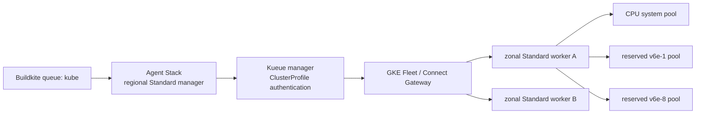

# Production-oriented Buildkite TPU infrastructure

Status: design and Terraform foundation scaffold; not applied.

This directory turns the POC findings into a production-oriented target. It
does not replace the working Autopilot POC. The two designs intentionally live
side-by-side until the production acceptance gates pass.

- [`SETUP.md`](SETUP.md) is the ordered runbook: what a human runs, in order,
  with a gate after every step.
- [`PRODUCTION_READINESS.md`](PRODUCTION_READINESS.md) is the prioritized gap
  analysis and rollout plan.
- [`terraform`](terraform) creates the Google Cloud foundation: APIs, regional
  manager, zonal Standard workers, CPU and TPU node pools, Fleet registration,
  IAM, Artifact Registry, and Secret Manager metadata.
- [`kueue`](kueue) shows the simplified Standard-GKE scheduling objects and the
  secretless Fleet ClusterProfile connection model.
- [`cache`](cache) holds the compilation-cache loop: the golden PVC each job
  clones, the identities that reach GCS, and the CronJob that promotes
  published entries back into the golden.

## Target shape



The manager is regional because it runs control-plane workloads and does not
bind TPU PVCs. Each worker is zonal because TPU capacity, reservations, and
`premium-rwo` volumes are zonal. A worker has a small CPU system node pool and
one Standard TPU node pool per logical profile.

## What Standard GKE removes

Reservation use moves from an Autopilot `ComputeClass` into the TPU node pool's
`reservation_affinity`. TPU topology moves into the node pool's
`placement_policy`. The node pool carries a stable label:

```text
tpu-ci.google.com/profile=v6e-1
tpu-ci.google.com/profile=v6e-8
```

Kueue ResourceFlavors select that label. The production Agent Stack plugin
profile should set the Kueue queue label and request `google.com/tpu`, but should
not repeat region, zone, reservation, ComputeClass, or GKE topology selectors.
This makes regional movement a platform change rather than a pipeline change.

Standard GKE does not remove the need for a ResourceFlavor: Kueue still needs a
logical mapping between admitted quota and schedulable nodes. It only makes the
flavor smaller and more stable.

## Worker authentication

The POC uses a Secret containing a kubeconfig and bearer token. Do not carry
that bootstrap into production.

The target uses Fleet-generated `ClusterProfile` objects and the GKE auth
plugin:

1. Terraform registers manager and workers in the same Fleet.
2. Manager resource labels ask Fleet to generate `ClusterProfile` inventory in
   `kueue-system`.
3. The manager Kueue KSA receives Connect Gateway and GKE access through
   Workload Identity Federation.
4. Kueue invokes a pinned `gcp-auth-plugin` executable to obtain short-lived
   credentials.
5. `MultiKueueCluster.spec.clusterSource.clusterProfileRef` selects the worker.

No worker bearer token or kubeconfig is placed in Terraform configuration,
Terraform state, Git, or a Kubernetes Secret.

Install the manager Kueue Helm release with release name or `fullnameOverride`
`multikueue-fleet`, producing KSA
`multikueue-fleet-controller-manager`. Keep worker releases named `kueue`.
This distinction is security-sensitive: workload identity subjects do not
contain a GKE cluster name, so reusing `kueue-controller-manager` would grant
the Fleet project roles to worker controllers with the same namespace/KSA.

Important: `MultiKueueClusterProfile` is alpha in Kueue 0.19, the version used
by the POC. The official GKE integration is the right target, but production
requires upgrading to a Kueue version where the team accepts its maturity,
pinning the auth plugin by digest, and running failover/rotation tests. Until
then, keep the POC secret isolated and rotate it automatically; do not call it
production-ready.

### Cross-project and VPC boundaries

The manager and worker clusters may be in different Google Cloud projects,
regions, and VPC networks. They do not need VPC peering or direct Pod-to-Pod
connectivity when MultiKueue uses Fleet-generated `ClusterProfile` objects and
Connect Gateway. In that model, the manager reaches each worker Kubernetes API
through Google APIs rather than through the worker control plane's private VPC
address:

```text
manager Kueue -> Google APIs -> Fleet Connect Gateway -> worker Kubernetes API
```

A useful ownership model is:

- a fleet host project contains the Fleet and manager cluster;
- worker projects contain their GKE clusters, TPU reservations, node pools,
  disks, quotas, and compute billing;
- each worker cluster is registered to the manager's Fleet, noting that a
  cluster can belong to only one Fleet;
- the manager Kueue identity receives Connect Gateway access in the fleet host
  project and GKE access in every worker project.

For the current role model, grant the manager-only KSA principal
`roles/gkehub.gatewayEditor` in the fleet host project and
`roles/container.developer` in each worker project. These project-wide roles
are broad; production should narrow them with IAM Conditions or project/fleet
isolation after validating the exact resource names and permissions. Do not
reuse this manager KSA name on worker clusters.

Separate VPCs still need outbound access to the required Google APIs, normally
through public egress or Private Google Access. VPC Service Controls and
organization policy must permit the GKE, Fleet, and Connect Gateway calls.
Direct network connectivity becomes necessary only when using kubeconfigs that
target private worker control-plane addresses, when tests communicate across
clusters, or when a worker consumes a private cache, model, dataset, registry,
or other service in another VPC. Those data-plane paths are independent of
MultiKueue dispatch and may use local replication, Shared VPC, Private Service
Connect, peering, or VPN according to the service.

Kueue quota remains declarative in each ClusterQueue. Fleet does not discover
or synchronize TPU reservation or project quota automatically, so the platform
operator must keep advertised nominal quota aligned with usable capacity in
each worker project.

## Terraform boundaries

Terraform owns slow-moving Google resources:

- service APIs;
- GKE clusters and node pools;
- Workload Identity and project IAM;
- Fleet registration and ClusterProfile inventory labels;
- Artifact Registry repository;
- Secret Manager secret container, but never its value.

Kueue queues/flavors and workload policy remain YAML managed by GitOps or a
small internal Helm chart. This avoids Terraform CRD plan-time coupling and
lets scheduling policy roll back independently of a cluster. Kueue and Agent
Stack Helm releases may be added to a separate platform stack once their exact
versions and values are approved.

The Terraform supports the cross-project layout above through the optional
`worker_project` variable and an aliased `google.worker` provider. Worker
clusters, their node pools, and their node service accounts are created there,
while the Fleet, manager cluster, and Artifact Registry stay in `project_id`.
Cross-project deployments also enable the required APIs in the worker project,
grant the manager Kueue identity `roles/container.developer` there, and add a
repository-level Artifact Registry reader binding so worker nodes can pull the
test image from the manager project. Leave `worker_project` null to keep both
sides in one project. Either way this is an infrastructure-module concern; it
does not change Buildkite pipeline or Kueue workload selection.

One worker project is assumed for all workers. Spreading workers across several
projects needs a child module instantiated per project, because Terraform
cannot select a provider alias per `for_each` key.

Do not put any of these in Terraform state:

- Buildkite agent tokens;
- worker kubeconfigs or service-account tokens;
- Hugging Face tokens;
- private model-registry credentials.

The foundation creates an empty Secret Manager container. Add versions through
an approved secret workflow. Use GKE native secret sync or External Secrets to
materialize `agent-stack-k8s-secret` in the manager and every worker, with
automatic rotation.

## Applying the foundation

This is a new-cluster design. GKE cannot convert an Autopilot cluster into a
Standard cluster in place. Do not point it at the POC names and expect a safe
update.

1. Create or select VPC subnets, secondary Pod/Service ranges, Cloud NAT, and
   private Google access in the network stack.
2. Create a versioned GCS Terraform-state bucket with narrowly scoped IAM.
3. Copy `backend.tf.example` to `backend.tf` and set the bucket.
4. Copy `terraform.tfvars.example` to a non-secret environment tfvars file.
5. Replace reservation names, ranges, network paths, project, and authorized
   CIDRs.
6. Initialize, format, validate, and inspect the plan:

```bash
cd .buildkite/kubernetes/production/terraform
terraform init
terraform fmt -check -recursive
terraform validate
terraform plan -out=production.tfplan
terraform show production.tfplan
```

7. Apply through the protected infrastructure pipeline with workload identity
   or service-account impersonation, not a downloaded key.
8. Add the Buildkite token as a Secret Manager version outside Terraform.
9. Install secret synchronization, Kueue, the pinned ClusterProfile auth plugin,
   policy controls, and Agent Stack through the platform deployment process.
10. Verify Fleet inventory before applying any `MultiKueueCluster`:

```bash
kubectl -n kueue-system get clusterprofile
kubectl get multikueuecluster
```

The example manifests assume the generated worker ClusterProfile is named
`tpu-ci-southamerica-west1-a`. Use the actual Fleet-generated name.
Install `manager-config.yaml` as the manager Helm configuration and apply
`manager-auth-plugin-patch.yaml` through the chart's post-render/Kustomize
stage after replacing the image placeholder with a signed digest. The GKE
reference implementation currently requires building this plugin image; do not
pull a mutable third-party build into the control plane.

## Importing existing production resources

If production clusters, repositories, or Secrets already exist, import them
into reviewed remote state before applying. Never use Terraform to recreate a
reservation or secret merely to make the plan green. Reservations remain
inputs to the TPU node pools; this stack consumes them but does not create or
resize them.

## Rollout sequence

Use a parallel migration:

1. Create the manager and one worker without changing the existing queue.
2. Verify ClusterProfile authentication and Kueue smoke Jobs.
3. Install Agent Stack on a disposable Buildkite queue such as `kube-canary`.
4. Run controlled same-commit tests and lifecycle fault injection.
5. Add the real `kube` queue only after cancellation, secret rotation, and
   readiness behavior are proven.
6. Add regions one at a time and verify dispatch under unavailable capacity.
7. Retain the bare-metal pipeline until the decision gates are satisfied.

## Version policy

Pin all of the following in the platform stack and upgrade them deliberately:

- GKE release channel and maintenance windows;
- Kueue chart and CRDs;
- ClusterProfile API CRD/controller;
- GKE auth plugin image digest;
- Agent Stack chart/controller;
- policy engine and secret synchronization controller.

The Terraform scaffold allows a provider major range only to keep the example
maintainable. Commit `.terraform.lock.hcl` after the first reviewed `init` so a
real environment uses exact provider checksums.
