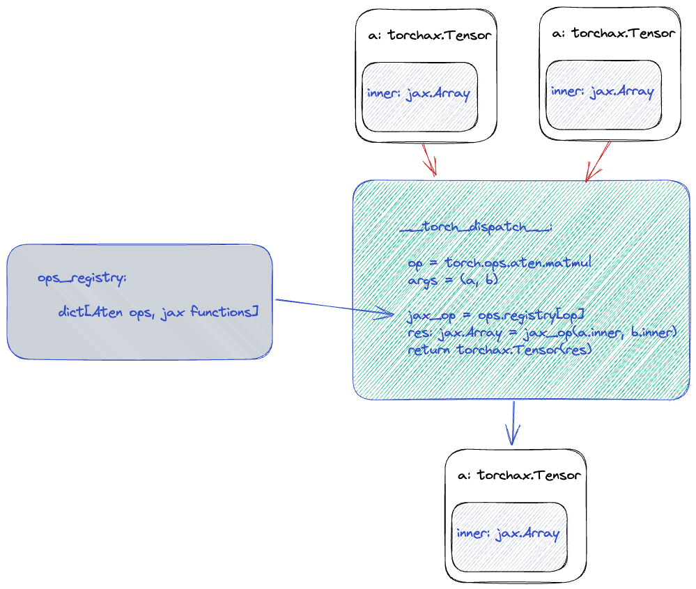

# How is torchax used in vLLM

**Authors: Siyuan Liu, Hongmin Fan, Han Qi**

**Last Updated: Sep 26, 2025**

## What is torchax

torchax is a library for providing JAX and PyTorch interoperability.
meaning, you can now run PyTorch and JAX in the same process, in all hardwares where
JAX runs (including NVidia GPUs and Google TPUs).

It can be thought as either:
* A PyTorch front-end for JAX, OR,
* a JAX backend for PyTorch.

With torchax you can:

* Run PyTorch code on TPUs with as little as 2 lines of code change.
* Call a JAX function from a PyTorch function, passing in jax.Array s.
* Call a PyTorch function from a JAX function, passing in a torch.Tensor s.
* Use JAX features such as jax.grad, optax, and GSPMD to train a PyTorch model.
* Use a PyTorch model as feature extractor and use it with a JAX model.

It works by having a `torch.Tensor` subclass that holds an `jax.Array`,
and implementing all `torch` operators that this tensor is supposed to support.



See  [this page](https://google.github.io/torchax/) for more details on how torchax works.

## TPU JAX worker

A vllm Worker interacts with vllm's LLM Engine via common methods like init_device, determine_available_memory, execute_model, compile_or_warm_up_model, profile etc.

Each worker has a runner - mainly for backend specific implementation.
Mainly including the following:

* Model initialization & weight loading
* Determine number of kv cache blocks (code pointer)
* Capture graphs: Run model with different input shapes to run all possible graphs, avoid compilation happening during serving.
* Execute model given a scheduler output (Preprocess inputs for model, run model, generate sampled token for each reqs)

Jax TPU worker is a new Worker implementation introduced in tpu_common, it is responsible
of calling both the a model implemented using Jax or using Torch.

### Interaction between Jax worker and torch model

When Jax worker instantiates, it uses a `get_model` function to get
a callable representing the model. The callable is a pure function (does not have states),
so both the weights, kv cache, as well as the input will be passed in
as input to this function.


When the worker runs a model, it will call the model function. The model function
that takes Jax Arrays as inputs.


### Pure functions

JAX transformation and compilation are designed to work only on Python functions that are functionally pure: all the input data is passed through the function parameters, all the results are output through the function results. A pure function will always return the same result if invoked with the same inputs.

If some arrays are used in the computation but they are not a function input, it will be inlined in the graph as constant

PyTorch forward function doesn’t take model weights as input arg -> need to use [torch.func.functional_call](https://docs.pytorch.org/docs/stable/generated/torch.func.functional_call.html).

As we see from the official doc above, `functional_call` allows one pass
the weight's as input (instead of weights being read from attributes of the model object).

```python
import torch
import torch.nn as nn
from torch.func import functional_call, grad

x = torch.randn(4, 3)
t = torch.randn(4, 3)
model = nn.Linear(3, 3)

def compute_loss(params, x, t):  # params is the weights as a dict of Tensos
    y = functional_call(model, params, x)
    return nn.functional.mse_loss(y, t)

grad_weights = grad(compute_loss)(dict(model.named_parameters()), x, t)
```

### KV Cache

With functional call, we can pass in the weights in the function input,
now, we still need to handle the KV cache. KV cache are inputs / outputs
of our `model_fn`. However, traditionally `vllm` upstream writes them
as model attributes.

We can place the KV cache in there manually before calling the model and return them.

Take a look on the following illustrative example:

```python
def f(cache, x):
  cache += x

cache = jnp.zeros(3)
x = jnp.ones(3)

jax.jit(f)(cache, x)

# prints 0
print(cache)
```

The code above simulates an in-place update of a `cache` variable, and
we can see that this change does not propagate outside of the
`jax.jit`'d region.

```python

def functional_f(cache, x):
  cache += x
  return cache

cache = jnp.zeros(3)
x = jnp.ones(3)

updated = jax.jit(functional_f)(cache, x)
cache = updated #<-- write back the update

# prints 1
print(cache)
```

The trick is to have the function inside of `jax.jit` return updated
KV cache, and we reassign the modification back.

The code that uses the above technique is located at: `tpu_inference/models/torchax/torchax_wrapper.py#L55-L83` show below:


## Mental model

`torchax` is `JAX`.

How torchax works is by having a torch front end; so that each torch operator eventually becomes JAX functions acting on JAX arrays. Therefore,
the approach we are taking here is to:
1. Use the same JAX-based worker that handles JAX models.
2. Use torchax to make `torch.nn.Module` look like a JAX model to the worker.
3. Use JAX based approach for KV cache and Attention kernel (such as RaggedPagedAttention).


Model execution pseudo code:

```python

inputs : jax.Array = prepare_inputs()  # shared by jax model and torchax model
inputs_torch : torch.Tensor = torch_view(inputs)  # a torch.Tensor subclass that holds an jax.Array
outputs_torch : torch.Tensor = torch.func.functional_call(torch_model, weights, inputs_torch) # kv caches are handled in VllmModelWrapper
outputs = jax_view(outputs_torch)
# ...
# sampler logic implemented based on jax, shared by jax model and torchax model
```

Attention kernel call pseudo code:

```python

# q, new_k, new_v : torch.Tensor
# kv_cache : jax.Array
q = jax_view(q)
new_k = jax_view(new_k)
new_v = jax_view(new_v)
output : jax.Array = attention_kernel(q, new_k, new_v, kv_cache, ...)
output : torch.Tensor = torch_view(output)
```
