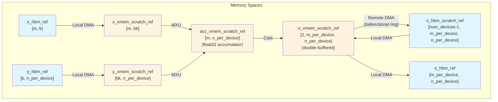
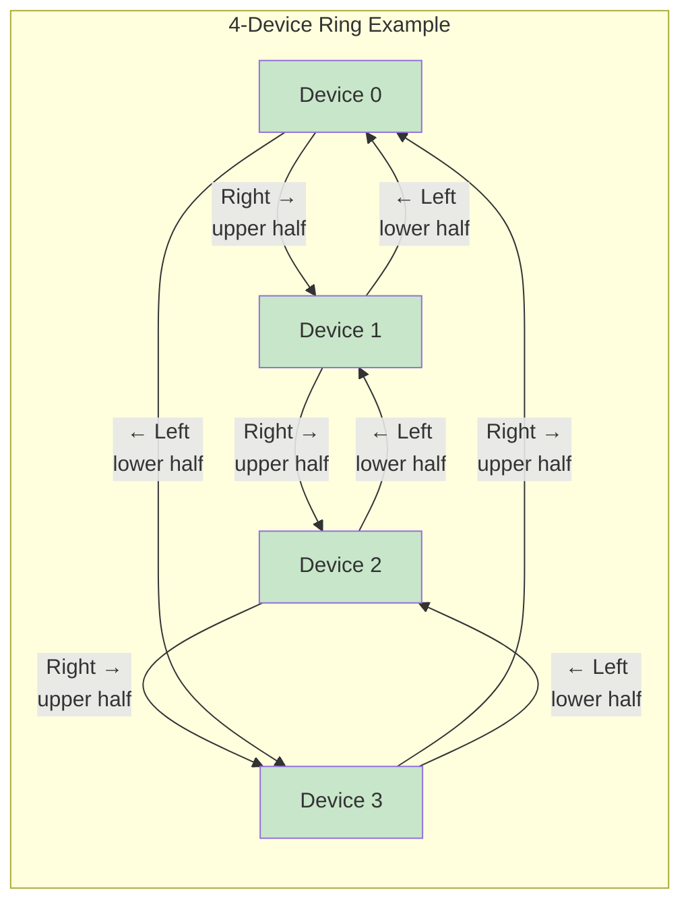
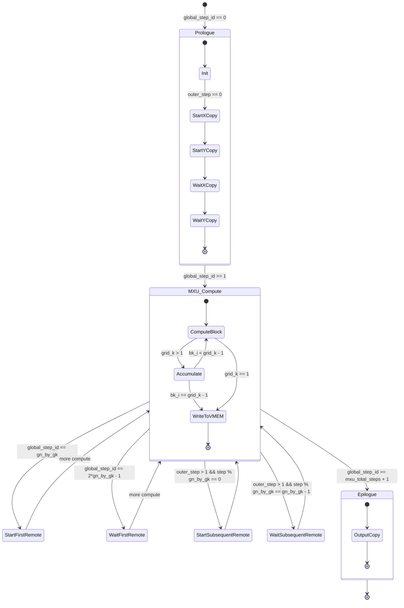
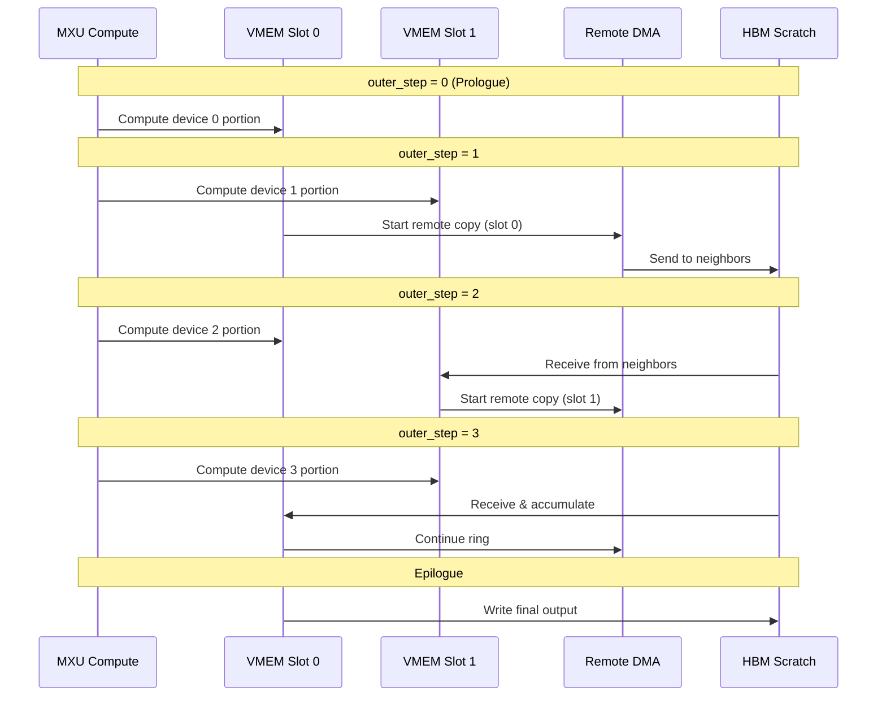
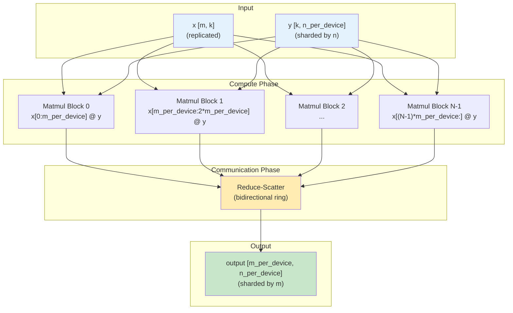

# Reduce-Scatter Matmul Kernel Pipelining

This document visualizes the pipelining structure of the reduce-scatter matmul kernel.

## Overview

The kernel uses a **bidirectional ring topology** for communication and overlaps computation with data movement through careful pipelining.

**Grid dimensions:** `(num_devices + 2, grid_n, grid_k)`
- `outer_step`: Device iteration (0 to num_devices + 1)
- `bn_i`: Block iteration over n dimension
- `bk_i`: Block iteration over k dimension

## Memory Hierarchy

## Bidirectional Ring Topology

## Pipeline Timeline (4 Devices, grid_n=1, grid_k=1)

This shows the execution timeline across `global_step_id`:

```mermaid
gantt
    title Reduce-Scatter Matmul Pipeline Timeline
    dateFormat X
    axisFormat %s

    section Prologue
    Init & Barrier           :done, init, 0, 1
    Start X Local Copy       :done, x_start, 0, 1
    Start Y Local Copy       :done, y_start, 0, 1
    Wait X Local Copy        :done, x_wait, 0, 1
    Wait Y Local Copy        :done, y_wait, 0, 1

    section MXU Compute
    MXU (device 0 portion)   :active, mxu0, 1, 2
    MXU (device 1 portion)   :active, mxu1, 2, 3
    MXU (device 2 portion)   :active, mxu2, 3, 4
    MXU (device 3 portion)   :active, mxu3, 4, 5

    section Remote Copy
    Start 1st Remote Copy    :crit, rc1_start, 1, 2
    Wait 1st Remote Copy     :crit, rc1_wait, 2, 3
    Start 2nd Remote Copy    :crit, rc2_start, 2, 3
    Wait 2nd Remote Copy     :crit, rc2_wait, 3, 4
    Start 3rd Remote Copy    :crit, rc3_start, 3, 4
    Wait 3rd Remote Copy     :crit, rc3_wait, 4, 5

    section Epilogue
    Output Local Copy        :done, o_copy, 5, 6
```

## Detailed Pipeline State Machine

## Double-Buffering Scheme

The kernel uses double-buffering for the output VMEM scratch to overlap computation with communication:

## Slot Management

| Variable | Formula | Purpose |
|----------|---------|---------|
| `o_hbm_receiving_slot` | `outer_step` | HBM slot to receive remote data |
| `o_hbm_working_slot` | `outer_step - 1` | HBM slot with data to process/forward |
| `o_vmem_receiving_slot` | `outer_step % 2` | VMEM slot for new computation |
| `o_vmem_working_slot` | `(global_step_id - 1) // gn_by_gk % 2` | VMEM slot with completed computation |

## Data Flow Per Device

## Key Pipeline Conditions

| Condition | When Triggered | Action |
|-----------|----------------|--------|
| `global_step_id == 0` | Start | Initialize accumulators, barrier sync |
| `outer_step == 0` | Prologue | Load x, y from HBM to VMEM |
| `global_step_id ∈ [1, mxu_total_steps]` | Main loop | MXU computation |
| `global_step_id == gn_by_gk` | After 1st device compute | Start first remote copy |
| `global_step_id == 2*gn_by_gk - 1` | Before 2nd device compute ends | Wait for first remote copy |
| `outer_step > 1 && step % gn_by_gk == 0` | Each device boundary | Start subsequent remote copy |
| `outer_step > 1 && step % gn_by_gk == gn_by_gk - 1` | Each device boundary end | Wait for subsequent remote copy |
| `global_step_id >= mxu_total_steps + 1` | Epilogue | Write output to HBM |

## Performance Optimization

The pipelining achieves high efficiency by:

1. **Overlapping compute & communication**: While MXU computes for device i+1, DMA transfers results for device i
2. **Double-buffering**: Two VMEM slots allow concurrent read/write operations
3. **Bidirectional ring**: Sends upper half left, lower half right simultaneously, halving communication time
4. **Block-based computation**: Processes in (bn, bk) blocks to fit in VMEM while maximizing MXU utilization
